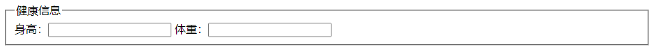
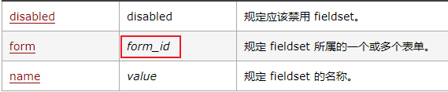

# \<fieldset>标签
```HTML
<form>
  <fieldset>
    <legend>health information</legend>
    height: <input type="text" />
    weight: <input type="text" />
  </fieldset>
</form>
```
效果：
  

<font color="red">\<legend> </font>标签为 fieldset 元素定义标题。  

具有以下属性：  
  