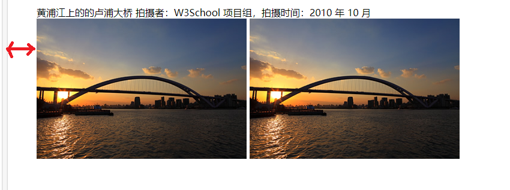
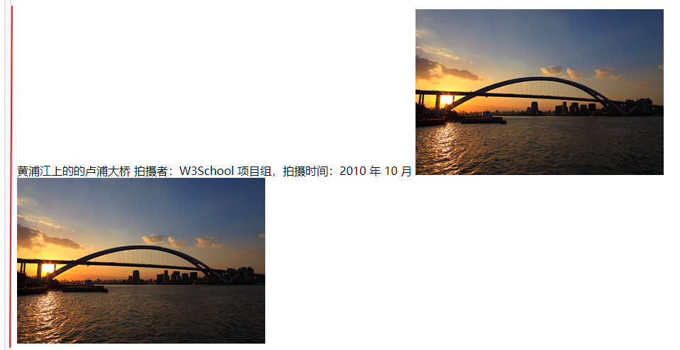

# \<figure>标签
一般给文档中插图用的  
+ 会缩进  
+ 图片会自动换行  
+ 文字后的图片会自动换到新的一行  

例：  
```HTML
<figure>
  <span>黄浦江上的的卢浦大桥</span>
  <span>拍摄者：W3School 项目组，拍摄时间：2010 年 10 月</span>
  
  
</figure>
```


```HTML
<span>黄浦江上的的卢浦大桥</span>
<span>拍摄者：W3School 项目组，拍摄时间：2010 年 10 月</span>


```

