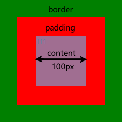
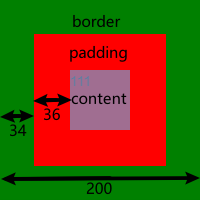

# 怪异盒子模型

```css
box-sizing： border-box  |  content-box
```
以下面的div为例：  
```HTML
<div style="
  width: 100px; height: 100px;
  background-color: red;
  padding: 36px; border: 34px solid green;
">
  111
</div>
```
设置box-sizing: content-box;：   
  
由此可见content-box盒子是不包含padding跟border的。（往外扩）  

border-box以下面为例  
```HTML
<div style="
  width: 200px; height: 200px;
  background-color: red;
  padding: 36px; border: 34px solid green;
">
  111
</div>
```

设置box-sizing： border-box；：  
   
由此可见border-box盒子是包含padding跟border的。显示内容的宽高是盒子的宽高减去padding减去border后剩余的位置。（往里缩）  

edge浏览器默认的盒子模型是border-box。