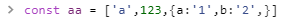
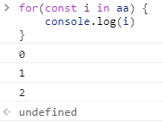
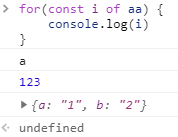
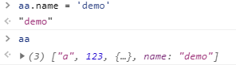
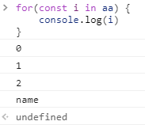
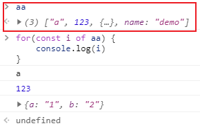
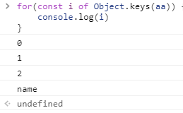

# for (in/of)

二者都是遍历，但是遍历出来的对象不一样。  
for in遍历出来Key值，  
for of遍历出来Value值  

<b>
  对象
  推荐使用for in循环。  
  数组
  推荐使用for of循环。  
  这里使用的跟vue中的v-for=xx in XX，或v-for=xx of XX不太一样，所以不要弄混了。
</b>  
 
 

  
### for in 
  
### for of 
 
### 给aa添加自定义属性name。
 
### for in可以遍历出来自定义属性
 
### for of是遍历value的，所以无法遍历出来新添加的属性
 
### 想要for of实现for in的能力，可以让for of联合Object.keys来实现
 