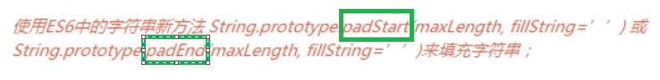
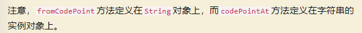

# padStart/padEnd 字符串新方法
字符串独有的方法，只能字符串使用  
padStart：从头开始填充  
padEnd：从尾开始填充  
   
fromCodePoint :  Unicode码点返回对应字符（超过0xFFFF的字符亦可解析），   
codePointAt: 字符返回对应码点（与上面的刚好相反）   
;  

```javascript
String.fromCodePoint(0x20BB7)


var s = "𠮷";

s.length // 2
s.codePointAt(0) // 134071
s.codePointAt(1) // 57271
```