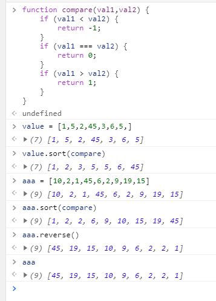

# sort

sort会将所有数值转换为string型数据来进行比较排序会出现下列问题：
```javascript
var value = [0, 1, 5, 10, 15];
values.sort();
alert(values);  // 0,1,10,15,5
```
所以一般会自己写一个比较方法（compare），传入sort函数中调用来进行正确排序。见下例：  
<font color="red">sort方法也会改变原数组。</font>    
