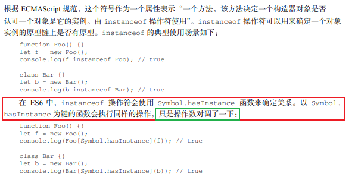

# Symbol

(此文脑子没记住，就先挂在这有时间再看，看完之后删掉这句话)
### Symbol.hasInstance  
<br>
<b>
表示：
<font color="red">
一个方法，该方法决定一个构造器对象是否认可一个对象是它的实例。由 instanceof 操作符使用
</font>
</b>

   
&emsp;&emsp; 对象的Symbol.hasInstance属性，指向内部方法，当其他对象使用instanceOf运算符，判断是否为该对象的实例时，会调用这个方法。比如：foo instanceOf Foo 在语言内部，实例调用的是  
&emsp;&emsp;o\[Symbol.hasInstance\](foo)  
调用instanceof方法总是返回布尔值，不是布尔值隐式转换为布尔值。当return返回的数据为true的时候返回true，当return返回的数据为false的时候返回false，
<font color="red">也就是说可以自定义修改规则：如下：</font>

```javascript
class MyClass{
    [Symbol.hasInstance](foo) {
        let drag = foo instanceof Array ? false : true;
        return drag;
    }
}
let obj = new MyClass();
console.log(1 instanceof obj); //true
console.log([1,2,3] instanceof obj); //false
```
```javascript
class Even {
    static [Symbol.hasInstance](obj) {
        return Number(obj) % 2 === 0;
    }
}
console.log(1 instanceof Even); //false
console.log(2 instanceof Even) //true
console.log(123456 instanceof Even) //true
```

### Symbol.isConcatSpreadable
对象的Symbol.isConcatSpreadable属性等于一个布尔值，表示该对象用于Array.prototype.concat()时，是否可以展开

```javascript
let arr1 = [1,2];
let arr2 = [3,4];
let arr3 = arr1.concat(arr2);
console.log(arr3); //展开拼接
console.log(arr1[Symbol.isConcatSpreadable]) //undefined
arr2[Symbol.isConcatSpreadable] = false; //设置arr2数组拼接时候不展开
let arr4 = arr1.concat(arr2);
console.log(arr4); //不展开拼接
```
上面代码说明，数组的默认行为是可以展开，Symbol.isConcatSpreadable默认值为undefined,该属性为true的时候也有展开效果。   
类似数组的对象正好相反，默认不展开，它的Symbol.inConcatSpreadable属性设为true，才可以展开。

```javascript
let objArr = {
     '0' : 'a',
    '1' : 'b',
    '2' : 'c',
    length : 3,
}
console.log(objArr[Symbol.isConcatSpreadable]); //undefined
let objArr2 = ['d','e'].concat(objArr);
console.log(objArr2); //['d','e',objArr]
objArr[Symbol.isConcatSpreadable] = true;
let objArr3 = ['d','e'].concat(objArr);
console.log(objArr3); //['d','e','a','b','c']
```
Symbol.isConcatSpreadable属性也可以写在类里面。

```javascript
class A1 extends Array{
    constructor(args){
        super(args);
        this[Symbol.isConcatSpreadable] = true;
    }
}
class A2 extends Array {
    constructor(args){
        super(args);
    }
    get [Symbol.isConcatSpreadable] () {
        return false;
    }
}
let a1 = new A1();
a1[0] = 3;
a1[1] = 4;
let a2 = new A2();
a2[0] = 5;
a2[1] = 6;
let arr = [1,2].concat(a1).concat(a2);
console.log(arr); //[1,2,3,4,A2{}]
//上面代码中，类A1是可以展开的，类2是不可展开的，所以使用concat时有不一样的结果。
```
注意：Symbol.isConcatSpreadable的位置差异，A1是定义在实例上的。A2是定义在类本身，效果相同

### Symbol.species
对象的Symbol.species属性，指向一个构造函数。创建衍生对象时，会使用该属性。

```javascript
class MyArray extends Array {}
const a = new MyArray(1,2,3);
const b = a.map(x => x);
const c = a.filter(x => x > 1);
console.log(b);
console.log(c);
console.log(b instanceof MyArray); //true
```
上面代码中。子类MyArray继承了父类Array，a是MyArray的实例，b和c是a的衍生对象。你可能认为，b和c都是调用数组方法生成的，所以应该是数组（Array的实例），但实际上它们也是MyArray的实例。Symbol.species属性就是为了解决这个问题而提供的。现在。我们可以为MyArray设置Symbol.species属性。

```javascript
class MyArray extends Array{
    static get [Symbol.species] () {
        return Array;
    }
 }
```
上面代码中，由于定义了Symbol.species属性，创建衍生对象时就会使用这个属性返回的函数，作为构造函数。这个例子也说明，定义Symbol.species属性要采用get取值器，默认的Symbol.species属性等同于下面的写法。
```javascript
class MyArray extends Array {
    static get [Symbol.species] (){
        return this;
    }
}
```
```javascript
class MyArray extends Array{
    static get [Symbol.species] () {
        return Array;
    }
}
const a = new MyArray(1,2,3);
const b = a.map(x => x);
console.log(b instanceof MyArray); //false
console.log(b instanceof Array); //true
```
上面代码中，a.map(x => x)生成的衍生对象，就不是MyArray的实例，而直接就是Array的实例
```javascript
class T1 extends Promise {}
class T2 extends Promise {
    static get [Symbol.species] () {
        return Promise;
    }
}
console.log(new T1(r => r()).then(v => v) instanceof T1); //true
console.log(new T2(r => r()).then(v => v) instanceof T2); //false
```
总之，Symbol.species的作用在于，实例对象在运行过程中，需要再次调用自身的构造函数时，会调用该属性指定的构造函数。它主要的用途是，有些类库是在基类的基础上修改的，那么子类使用继承的方法时，作者可能希望返回基类的实例，而不是子类的实例。

### Symbol.match
对象的Symbol.match属性，指向一个函数。当执行str.match(myObject)时，如果该属性存在，会调用它，返回该方法的返回值。
```javascript
String.prototype.match(regexp)
//等同于
regexp[Symbol.match](this)
```
```javascript
class MyMatcher {
    [Symbol.match] (str){
        return "Hello World!".indexOf(str);
    }
}
console.log('e'.match(new MyMatcher())); //1
```

### Symbol.replace
对象的Symbol.replace属性，指向一个方法，当该对象被String.prototype.replace方法调用时，会返回该方法的返回值。
```javascript
String.prototype.replace(searchValue , replaceValue)
//等同于
searchValue.replace(this,replaceValue)
```
```javascript
const x = {
    [Symbol.replace] (...s) {
        return console.log(s);
    }
}
let str = 'Hello'.replace(x,'World !');
```
Symbol.replace方法会受到两个参数，第一个参数是replace方法正在作用的对象。上面例子是Hello，第二个参数是替换后的值，上面例子是World

### Symbol.search
对象的Symbol.search属性，指向一个方法，当该对象被String.prototype.search方法调用时，会返回该方法的返回值。
```javascript
String.prototype.search(regxp)
//等同于
regexp[Symbol.search](this)

```

```javascript
class MySearch {
    constructor(value) {
        this.value = value;
    }
    [Symbol.search](str){
        return str.includes(this.value);
    }
}
console.log("foobar".search(new MySearch("foo"))); //true
```

### Symbol.split
对象的Symbol.split属性，指向一个方法，当该对象被String.prototype.split方法调用时返回该方法的返回值。
```javascript
String.prototype.split(separator,limit);
//等同于
separator[Symbol.split](this,limit);
```
```javascript
class MySplit {
    constructor(value){
        this.value = value;
    }
    [Symbol.split](str) {
        let index = str.indexOf(this.value);
        if(index === -1){
            return str;
        }
        return [
            str.substr(0,index),
            str.substr(index + this.value.length),
        ]
    }
}
console.log("foobar".split(new MySplit("foo"))); //["","bar"]
console.log("foobar".split(new MySplit("bar"))); //["foo",""]
console.log("foobar".split(new MySplit("baz"))); //foobar
```
上面方法使用Symbol.split方法，重新定义了字符串对象的split方法的行为。

### Symbol.iterator
对象的Symbol.iterator属性，指向该对象的默认遍历器方法。
```javascript
const myIterable = {};
myIterable[Symbol.iterator] = function*() {
    yield 1;
    yield 2;
    yield 3;
};
console.log([...myIterable]); //[1,2,3]
```
对象进行for...of循环时，会调用Symbol.iterator方法，返回该对象的默认遍历器
```javascript
class Collection {
    *[Symbol.iterator]() {
        let i = 0;
        while (this[i] != undefined) {
            yield this[i];
            ++i;
        }
    }
}
let myCollection = new Collection();
myCollection[0] = 1;
myCollection[1] = 2;
for(let value of myCollection){
    console.log(value); //1 2
}
```
### Symbol.toPrimitive
对象的Symbol.toPrimitive属性，指向一个方法。该对象被转为原始类型的值时，会调用这个方法，返回该对象对应的原始值类型值。
Symbol.toPrimitive被调用时，会接受一个字符串参数，表示当前运算的模式，一共有三种模式，  
+ Number：该场合需要转换为数值。
+ String：该场合需要转成字符串。
+ Default：该场合可以转成数值，也可以转成字符串。
```javascript
let obj = {
    [Symbol.toPrimitive](hint){
        switch(hint){
            case "number" :
                return 123;
            case "string" :
                return "str";
            case "default" :
                return "default";
            default :
                throw new Error();
        }
   }
};
console.log(2 * obj);
console.log("String : " + obj);
console.log(3 + obj);
console.log(obj == 'default');
console.log(String(obj));
```

### Symbol.toStringTag
对象的Symbol.toStringTag属性，指向一个方法。在该对象上面调用Object.prototype.toString方法时，如果这个属性存在，它的返回值会出现在toString方法返回的字符串之中，表示对象的类型。也就是说，这个属性可以用来定制[object Object]或者[object Array]中object后面的那个字符串。
```javascript
console.log({[Symbol.toStringTag] : 'Foo'}.toString()); //[object Foo]
```
```javascript
class Collection {
    get [Symbol.toStringTag] () {
        return 'xxx';
    }
}
let x = new Collection();
console.log(Object.prototype.toString.call(x)); //[object xxx]
```

ES6 新增内置对象的Symbol.toStringTag属性值如下。

+ JSON[Symbol.toStringTag]：'JSON',
+ Math[Symbol.toStringTag]：'Math',
+ Module 对象M[Symbol.toStringTag]：'Module',
+ ArrayBuffer.prototype[Symbol.toStringTag]：'ArrayBuffer',
+ DataView.prototype[Symbol.toStringTag]：'DataView',
+ Map.prototype[Symbol.toStringTag]：'Map',
+ Promise.prototype[Symbol.toStringTag]：'Promise',
+ Set.prototype[Symbol.toStringTag]：'Set',
+ % TypedArray %.prototype[Symbol.toStringTag]：'Uint8Array',
+ WeakMap.prototype[Symbol.toStringTag]：'WeakMap',
+ WeakSet.prototype[Symbol.toStringTag]：'WeakSet',
+ % MapIteratorPrototype % [Symbol.toStringTag]：'Map Iterator',
+ % SetIteratorPrototype % [Symbol.toStringTag]：'Set Iterator',
+ % StringIteratorPrototype % [Symbol.toStringTag]：'String Iterator',
+ Symbol.prototype[Symbol.toStringTag]：'Symbol',
+ Generator.prototype[Symbol.toStringTag]：'Generator',
+ GeneratorFunction.prototype[Symbol.toStringTag]：'GeneratorFunction',

### Symbol.unscopables
对象的Symbol.unscopables属性，指向一个对象。该对象指定了使用with关键字时，哪些属性会被with环境排除。
```javascript
console.log(Array.prototype[Symbol.unscopables]);
console.log(Object.keys(Array.prototype[Symbol.unscopables]));
```