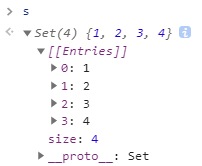

# Array.from/Array.of

## Array.from
将类数组转换为真实的数组实例。第一个参数是一个类数组对象，<font color="red">即任何可迭代的结构</font>，或者有一个 length 属性和可索引元素的结构。   
例：
```javascript
console.log(Array.from("Matt")); // ["M", "a", "t", "t"]
```
```javascript
  const s = new Set().add(1) 
                     .add(2) 
                     .add(3) 
                     .add(4); 
```

```javascript
console.log(Array.from(s)); // [1, 2, 3, 4] 
```
以前是使用扩展运算符将set数据展开，再组成数组。  
如下：
```javascript
console.log([...s]);  // [1, 2, 3, 4] 
```
<font color="red">会对现有数组进行浅复制</font>
```javascript
const a1 = [1, 2, 3, 4]; 
const a2 = Array.from(a1); 
console.log(a1); // [1, 2, 3, 4] 
console.log(a2); // [1, 2, 3, 4] 
alert(a1 === a2); // false 
```

## Array.of 
以把一组参数转换为数组  
这个方法用于替代在 ES6之前常用的 Array.prototype. 
slice.call(arguments)，一种异常笨拙的将 arguments 对象转换为数组的写法：  
```javascript
console.log(Array.of(1, 2, 3, 4)); // [1, 2, 3, 4] 
console.log(Array.of(undefined)); // [undefined] 
```