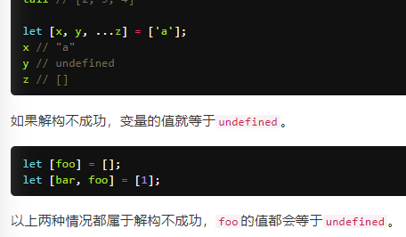
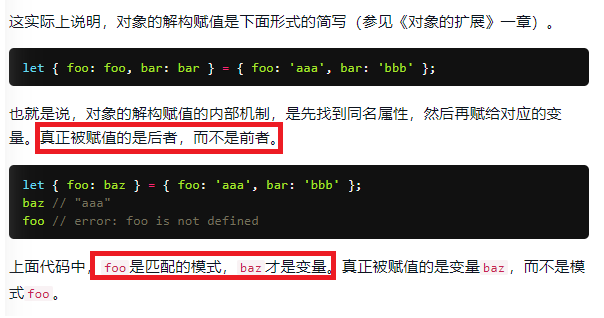
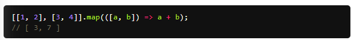

# 解构赋值
### 一、
  
上面的z为什么是[ ],下面的foo为什么是undefined？  
答：上面的z是...z,所以它对应的可以是[ ],而上面的y与下面的foo都不是...y或...foo，所以它们没有对应的值没有一为undefined。  
### 二、
  

### 解构赋值中map新知识
  
[a,b] = [1,2] => a + b = 1 + 2 = 3  
[a,b] = [3,4] => a + b = 3 + 4 = 7  
//map处理后的结果为[3,7] 