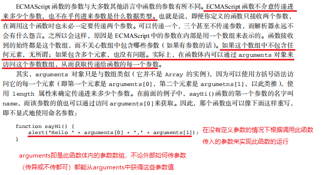

# 函数的arguments
  

<font color="red">arguments这个对象在全局环境中是不存在的。</font>  

虽然 arguments 的主要用途是保存函数参数，但这个对象还有一个名叫 <font color="red">callee</font>的属性，该属性是一个指针，<font color="red">指向拥有这个 arguments 对象的函数。</font>  
请看下面这个非常经典的阶乘函数：  
```javascript
function factorial(num){
    if (num <=1) {
          return 1;
    } else {
          return num * factorial(num-1)
    }
}
```
定义阶乘函数一般都要用到递归算法；如上面的代码所示，在函数有名字，而且名字以后也不会变的情况下，这样定义没有问题。但问题是这个函数的执行与函数名 factorial 紧紧耦合在了一起。为了消除这种紧密耦合的现象，可以像下面这样使用 arguments.callee。

```javascript
function factorial(num){
    if (num <=1) {
        return 1;
    } else {
        return num * arguments.callee(num-1)
    }
} 
```
<font color="green">&emsp;&emsp;在这个重写后的 factorial()函数的函数体内，没有再引用函数名 factorial。这样，无论引用函数时使用的是什么名字，都可以保证正常完成递归调用。</font>  
&emsp;&emsp;但是，在<font color="red">严格模式下，</font>不能通过脚本访问<font color="red">argument.callee，</font>访问这个属性会<font color="red">导致错误，</font>所以要使用<font color="red">命名函数表达式</font>来达成相同的结果。  
如下：  

```javascript
const factorial = function f(num) {
  if (num <= 1) {
    return 1;
  } else {
    return num * f(num - 1);
  }
}
```