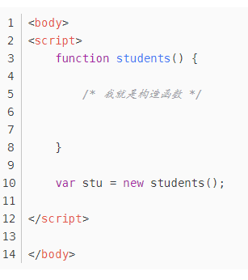
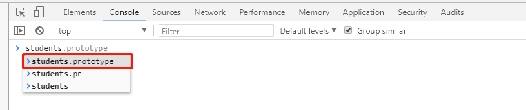
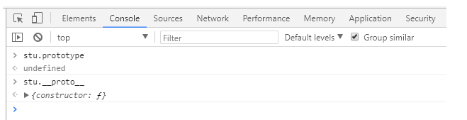

# 原型
### 对JS原型进行解释的时候，会涉及两个概念：构造函数、原型对象

1、构造函数： 将普通函数new一下的函数就叫做构造函数。  
2、原型对象：在创建了一个构造函数之后，浏览器会自动按照一定的规则在构造函数里面生成一个属性，这个属性就叫做原型(prototype)。这个原型其实是存储在了内存当中。  
3、constructor：原型是个对象，所以也可以叫它原型对象，它里面有个属性，叫做constructor。这个属性指向了当前的这个构造函数。  
4、实例：new出来的构造函数返回的对象就叫做实例。  
5、__proto__: 实例也是个对象，它上面有个属性叫做__proto__，这个__proto__属性又指向实例化它的构造函数的原型(prototype)。  

### 二、使用构造函数创建对象

我们的构造函数使用new来创建对象的时候，就像下面这样：  
  
&emsp;&emsp;此时，stu就是那个构造函数students创建出来的实例对象，这个stu实例中有__proto__属性，构造函数students中有prototype属性，请看图！
  
  
&emsp;&emsp;可以看出，构造函数students中有prototype属性，是students对应的原型对象；而stu是构造函数students创建出来的对象，他上面不存在prototype属性，所以在调用prototype的时候是undefined，但stu有一个__proto__属性，stu调用这个属性可以直接访问到构造函数students的原型对象（也就是说，stu的__proto__属性指向的是构造函数的原型对象）

