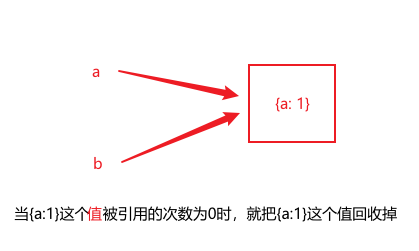

# 垃圾回收机制

### 记住几个重要的点
+ 1、执行环境
+ 2、标记清除：
  <font color="red">无用</font>
  的才会被
  <font color="red">标记</font>
  ，有用的被释放。清除的是带有标记的无用变量。
+ 3、引用计数：跟踪记录每个<font color="red">值</font>被引用的次数。<font color="red">（但这种存在着问题）</font>  


<b>
  采用引用计数的问题如下：
</b>  

```javascript
function problem() {
  var objA = new Object();
  var objB = new Object();

  objA.someOtherObject = objB;
  objB.someOtherObject = objA;
}
```
上面代码在执行完毕，离开作用域之后objA跟objB的引用依旧存在，且永远不为0，如此，如果这样的互相引用很多的话，就会造成大量的内存泄漏。  
>>> 但是像上面的例子我们可以手动切断他们的循环引用，  
objA .someOtherObject = null;  
objB.someOtherObject = null;  
