# 操作符(&& || ^ ! > < ......>)

### 位操作符
二进制32位表示中：负数是一个数的补码。（补码即为原码取反加一）
非操作符（~）：一个数的非运算是这个数取反减一。  
一个负数的二进制如何转化为十进制表示：（基本是原码求补码的逆过程
如下例： 二进制负数先加一再取反）  
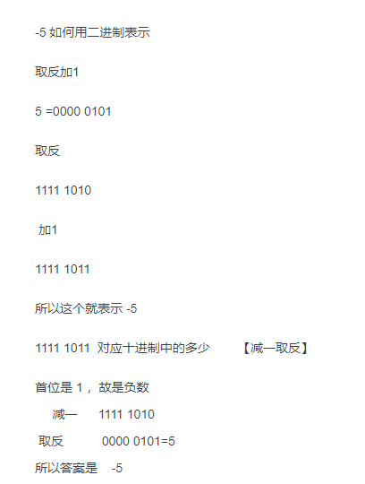  

与操作（&）（都为1才返回1）（且的意思）  
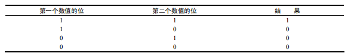  
或操作（|）（只要有1则为1）（或的意思）  
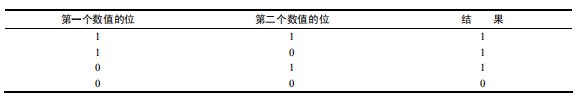  
异或（^）(相同的为0，不同为1)  
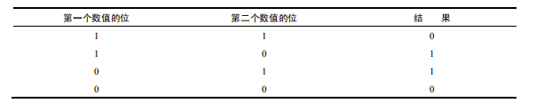

### 逻辑操作符
与（&&）  
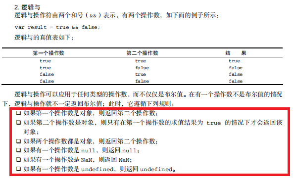  
或 （ || ）  
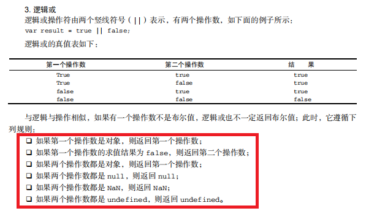  
非  ！  
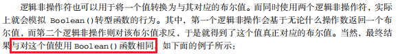  
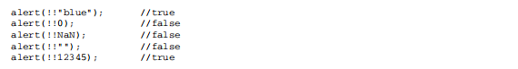  

### 关系操作符
小于（<）、大于（>）、小于等于（<=）和大于等于（>=）这几个关系操作符用于对两个值进行比较，这几个操作符都返回一个布尔值。  
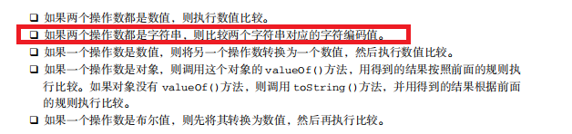  
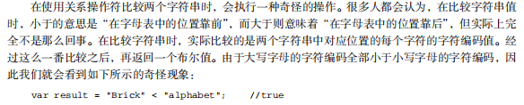   

### 相等不相等    全等与不全等
相等和不相等————先转换再比较； 全等与不全等————仅比较而不转换；

#### 相等与不相等
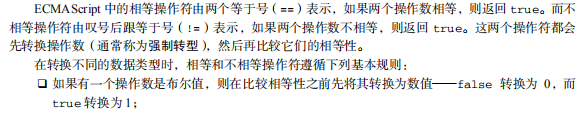  
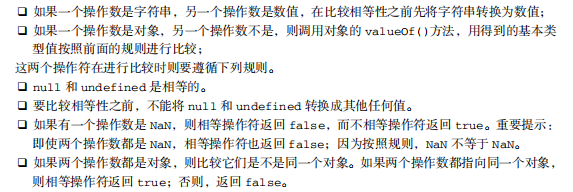 

#### 全等与不全等
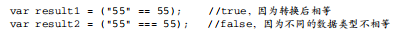  
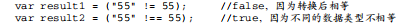   

null == undefined;   //true,  
null === undefined;   // false;   
本身undefined就是null引申出来的，所以二者转换后相等，但是二者类型不同，所以不全等。  

### 逗号操作符
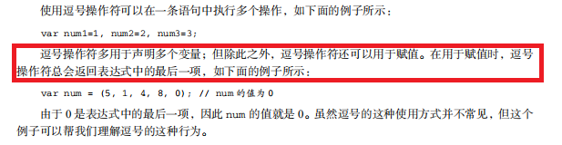 