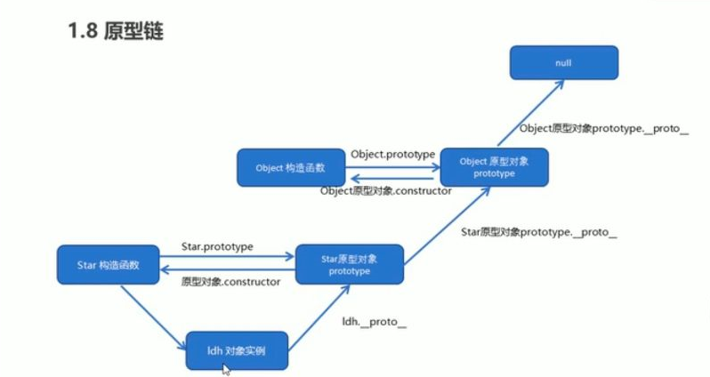

# 构造函数与普通函数的区别

有无new；  
构造函数的使用是  
&emsp;new Xxx();  
然后会：  
1、立刻在堆内存中创建一个新的对  
2、将新建的对象设置为函数中的this  
3、逐个执行函数中的代码  
4、将新建的对象作为返回值  
<br/>
普通函数仅使用，自动返回的额是undefined；  
<br/>

```javascript
function person（name）{
  this.name = name;
}
function Person（name） {
  this.name = name
}
```
```javascript
// 名称大小写仅仅只是习惯上的不同而已，构造函数习惯首字母大写；
const per = person（）；
console.log(per);   //  undefined;
console.log(per.name);    // Cannot read property 'name' of undefined;
```

```javascript
const person = new Perosn('zhangsan');
console.log(person);     //  Person {name: "zhangsan"}
console.log(person.name);    // zhangsan
```

区分了之后就知道 对象的原型， 原型对象，constructor之间的关系了吧。  
<b>普通函数里面是没有这些东西的；</b>

### 原型链
