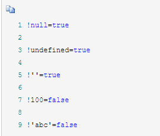
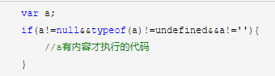
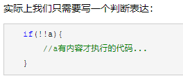

# ！
1、！可将变量转换成boolean类型，null、undefined和空字符串取反都为false，其余都为true。  
  
2、!!常常用来做类型判断，在第一步!（变量）之后再做逻辑取反运算，在js中新手常常会写这样  
臃肿的代码：  
判断变量a为非空，未定义或者非空串才能执行方法体的内容   
  
   
此刻如果a为null，或者undefined或者‘ ’，则!a为true,!!a为false，所以可以用!!a来代替a!=null&&typeof(a)!=undefined&&a!=' '.  

逻辑非：  
操作数为：  
1、！对象   =>  false  
2、！‘  ‘      =>  true  
3、！’abc‘   =>  false  
4、！0        =>  true  
5、！123456 || ！Infinity      =>    false  
6、！null    =>   true  
7、！NaN   =>   true  
8、！undefined     =>    true  