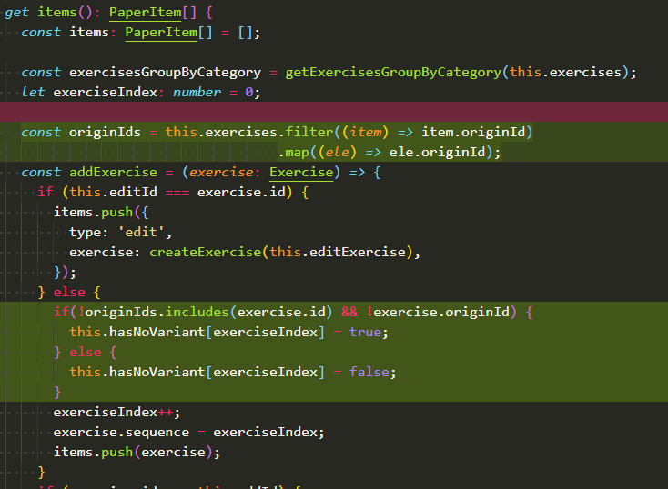

# 交给子组件去处理

1、很多地方数据处理牵涉到数组循环，尝试将这些值交给子组件去处理。  
例：  
原处理方法：在父组件循环里面加入判断，因为循环的exercise数据类型太多，并非固定的数据类型，所以，此处判断非常不好，不能很明确的知晓那里就一定是题目要走的路，也可能掺杂其他类型的数据要走。如果这里出错了，因为在循环里，更加不好找bug。 

  

优化后代码： 将所有的变式中的原题ID集合放进子组件，（此子组件就是习题组件，此中完全可以判断此题目的id是否有存在于变式的原题ID中）  
改后：  

父组件：  
   

子组件：  
    

2、还有如果组件粒度较粗的话, 可能会导致在模板里加入一些方法去计算的, 你可以把这部分抽出来作为子组件进行处理（此处未明白，未遇见实例，尚不明白具体）  
但说的感觉跟组件库中的打印组件实例相吻合。print.vue组件中有太多需要计算的方法，但不明确这些计算方法如何提到子组件中。（也可能跟处理横线上的平均分类似：一道习题上面可以拿到所有的平均分，但仅仅是数据结构处理不太对（此时的数据处理可以由父组件去做，亦可由子组件来做（仅改变数据结构，不改变数值，可（写个方法就好））））  
例：此方法将数据转置  

    

if(i === 0) { result.push } 是为了创建数组。else中的是为了之后的添加进去。