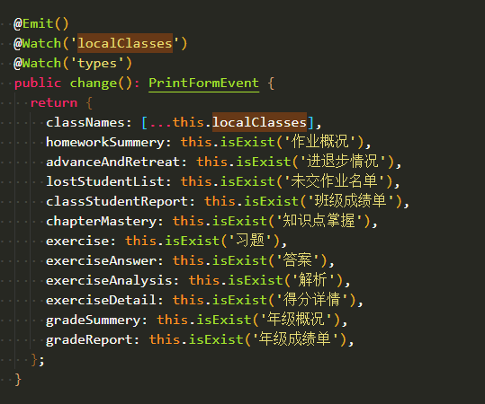
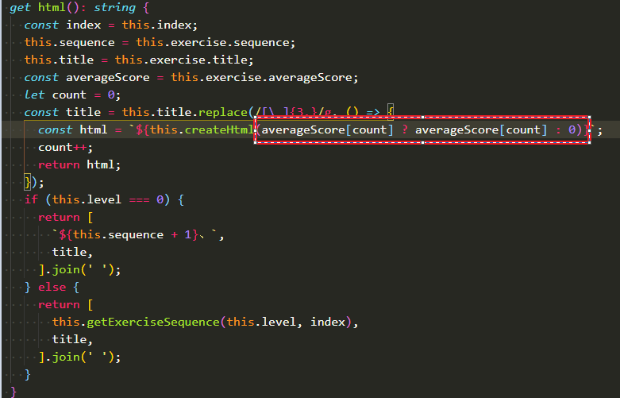
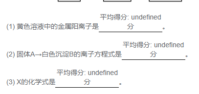

# 找bug与解决方法
## 解决方法  
1、善用判断，常记得用判断  
2、事件没反应，测试事件是否有被触发，可以看Vue中的Even有无触发事件，也可以在事件中console.log(),追根溯源，找到没触发是什么原因，（例：导航守卫：只在路由组件中可以使用）  
3、return是个好东西，多用用  
  

当显示时有错误时，善用三目运算  
  
  
averageScore[count] ? averageScore[count] : 0;  
上述这种三目运算，可以使用短路思想：averageScore  ||  0  

<b>平均分存在即使用平均分，不存在为undefined时用0代替   （可以气死我的事情之一！！！）</b>