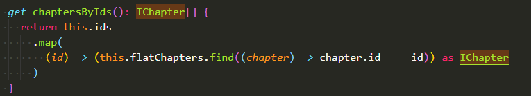
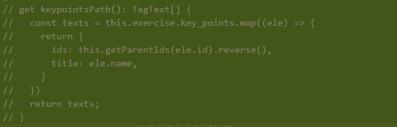
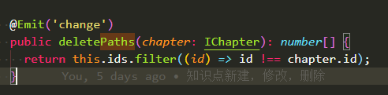
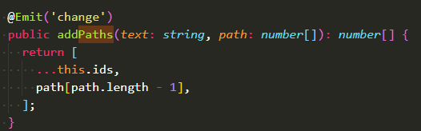

# 高架空逻辑，从顶层处理数据。

### 数据的更改一定放到唯一数据源去处理，子组件中的数据皆为传入数据。  

经典案例： 知识点组件的完成。  
传入的ids控制一切，同样通过父级的fetch方法控制ids的变化。  

  

而不是在自己组件中去处理数据，然后传给父组件。  
（之前自己做的时候想的是通过paths来控制tag上面显示的数据，处理完之后，在最后的时候传给父组件，但这样就跟传入个ids再获取它的path交给paths然后paths再处理自己的数据，重复操作，啰啰嗦嗦反反复复绕来绕去没完没了简直了，写的什么东西）  

  

上面的思路是，通过此处的知识点ids来获取每个知识点的全路径与知识点名称。  
然后传给jx-select，然后分配给paths与texts，处理完成之后在jx-select中处理paths与texts中的数据，然后再传给exercise-card组件去使用父组件中的fetch方法create，edit，delete去处理paths，然后exercise-card中的ids就变了，然后就会响应到jx-select中，如此循环，不如直接使用ids来控制，paths值当做一个需要传入给fetch中的参数，判断放入tag中的数据不再跟它挂钩。所有的数据全部与ids挂钩，而且fetch改后的数据也是直接影响到ids的。所以非常方便。  

 

删除与增加的显示同样通过过滤ids来拿到结果数据，只要删除与添加完之后的数据类型一样，则删除与添加功能完全是ok的。  

  
  

且其删除添加主要目的为tag上面数据的显示，真实的知识点数据为通过fetch方法调用接口实现的，然后删除与添加也是根据ids来判断则更加准确。  

所以：同一数据处理源非常重要，而fetch的方法是从父级传入的，自然也是父级处理过的数据。所以自己之前写的在子组件中处理paths非常蠢，绕来绕去没甚用处。  