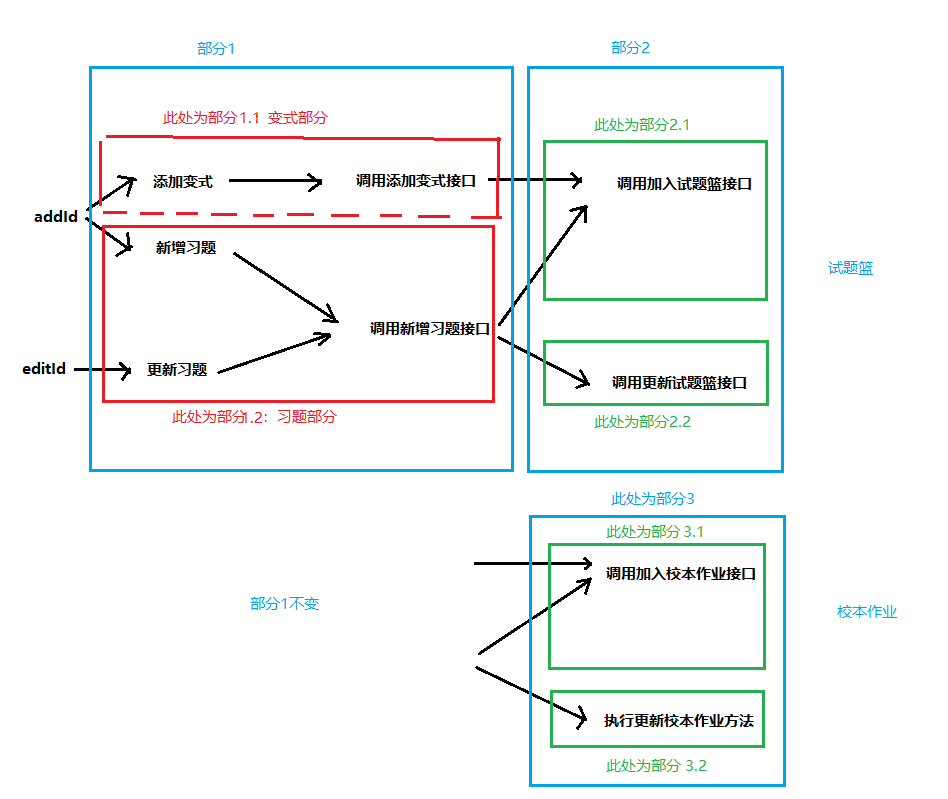

# 高端的思路 
高端的思路（清晰明确的思路）  
旧例子来说:  
三个功能：添加变式，新增习题，更新习题。  
两种模式：试题篮模式，校本作业模式。  

上述为牛掰的思路各路接口调用都只需写一次，自己的原思路：   
+ 添加变式一条路走下来
+ 新增习题一条路走下来
+ 更新习题一条路走下来  

出现的问题：  
+ 一、
    - 1、调用加入试题篮接口两次，
    - 2、调用新增习题接口两次，  

+ 二、上述一仅为试题篮模式时调用，就已经多次了，加入校本作业模式时，  
&emsp;&emsp;部分1须得再重复调用一次。  

解决方法：使用上图清晰地思路，共分为平行路线的三大部分，依次走下来就好。毕竟部分1是共同要走的路线，部分2,3使用是试题篮或是校本作业判断就可选择要走哪条路线，完全干涉不到。干净利落。
