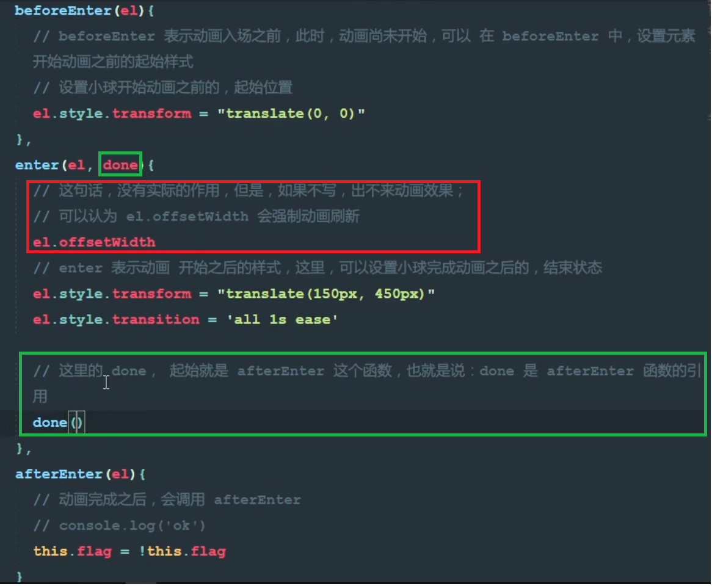

# 动画(2)
下图使用了一个叫animated的动画库，红色框内的都是库内属性名称，黄色框内的是css3新特性，入场时间，离场时间  
  

### <b>制作半场动画：</b>  
只有进场，或者出场动画，使用动画的生命周期钩子函数。  
  

<b>注意下图红色，绿色框中的语句。 </b>    

   

使用v-for渲染出来的数据，不能用transition包裹，实现动画效果，要用transtionGroup包裹  
   
   

离场时动作的过渡效果可通过v-move实现，但是想要v-move有效果，v-leave-active必须添加position：absolute；，又因为absolute在动作过程当中width默认为最小值，所以可为操作的dom添加width值  
   
   

### <b>为事件刚进场添加动画效果：</b>
   