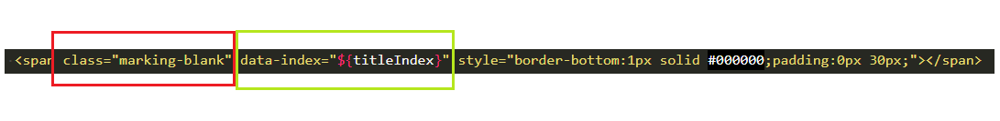
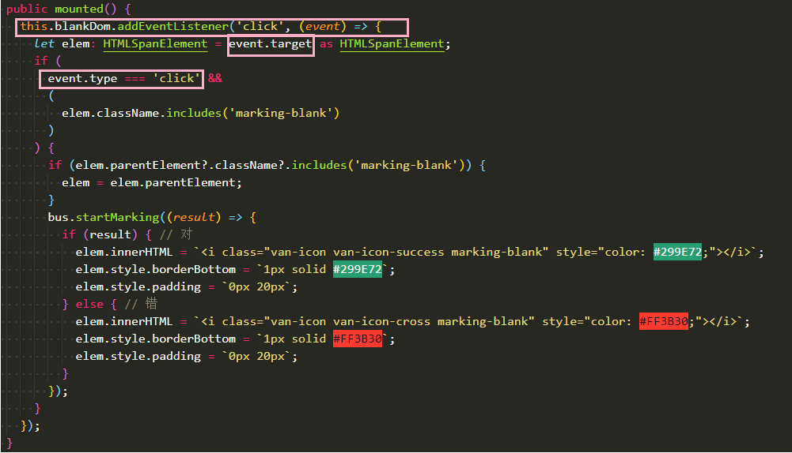

# 事件委派
html页面上的事件是依次冒泡触发的，由点击处依次冒泡到外层，所以想要在html某个标签上添加事件，可以由委派来实现：  
例如：  
  
在上面标签上添加点击事件，插入<i></i>标签。  
1、在此组件的最外层加上ref事件。  
2、在要绑定事件的标签上，添加标志性名称，如className，或者id之类的，上述表明为一类，再可添加data-id或data-index，或其他的data-XXX来标明唯一性。  
3、添加事件：  
  
  
因为event.target有可能为undefined，没有属性方法，但是自己知道event.target是什么所以才会使用断言让其为HTMLSpanElement。
