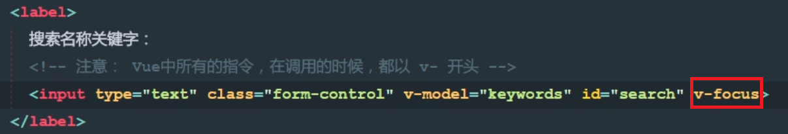
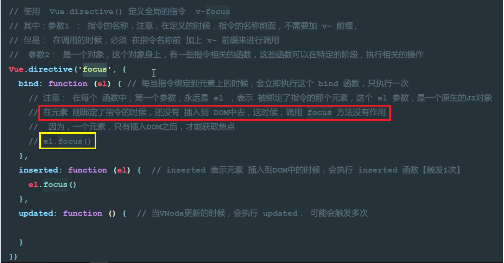
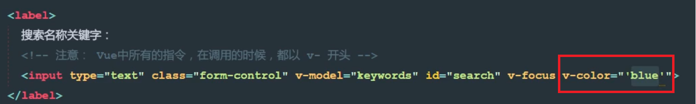
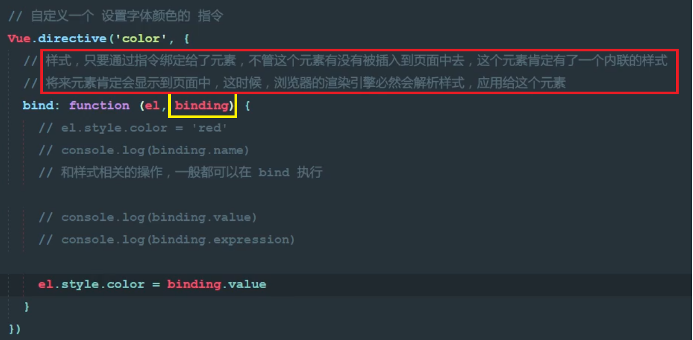
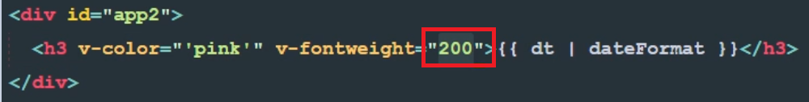
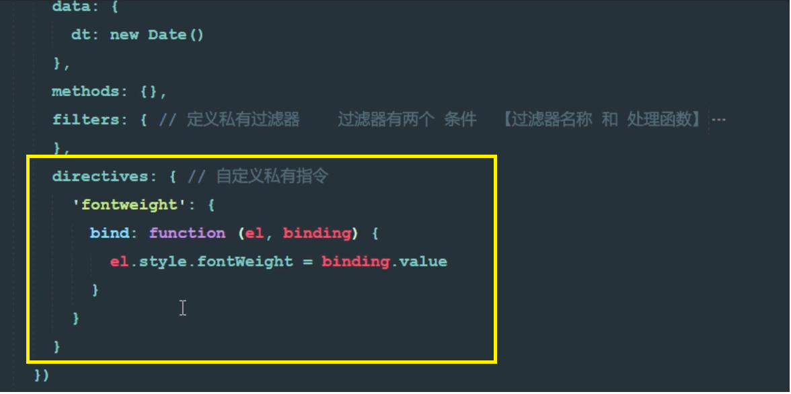
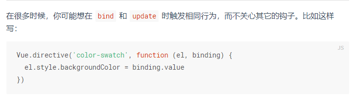

# vue2中自定义指令
自定义指令v-focus（注意图片里面的注释，很重要！！）  

  

下面为自定义指令阶段，分步截取图片（图片注释部分很重要！！）    

   
黄色框中的el-focus没有作用   

自定义指令v-color  
   

<b>第二个值可以查看Vue文档了解（下图）</b>  

   

上面的为全局指令，下面的是定义的私有指令：  

   
   
私有指令加s   

### 简写：（API文档说明）
   