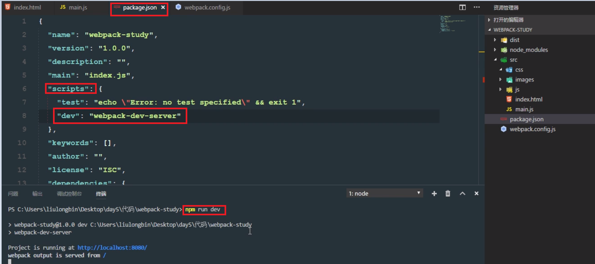
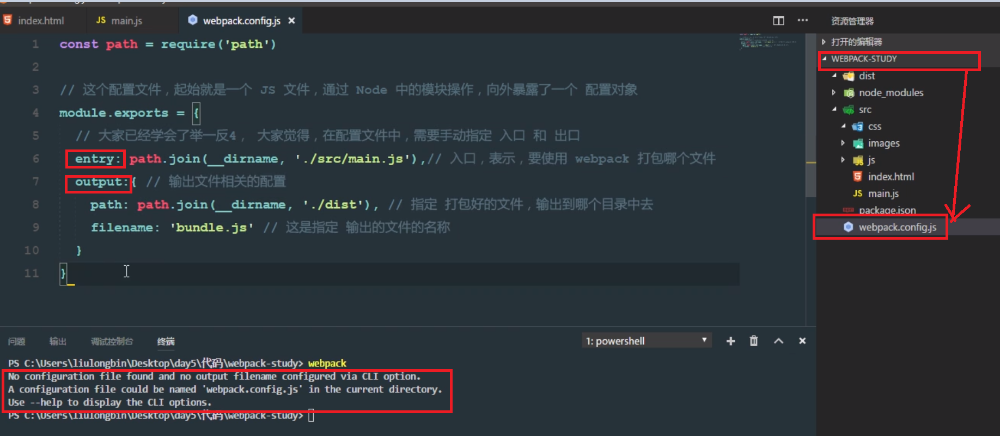
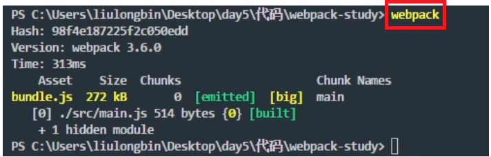
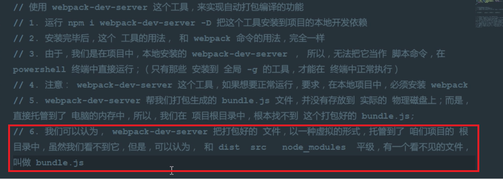
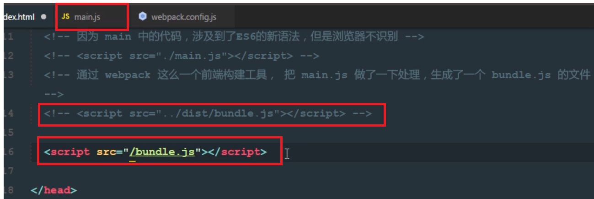
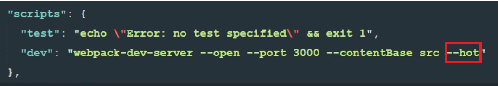

# webpack打包文件 
原始打包语句：  
例：  
  
  
不再手动每修改完一句代码便打包一次，直接在根目录下新建一份配置文件，写上入口文件与出口文件及生成的文件名。  
  
  
运行时仅需敲入webpack  
例：  
  
想要不再在命令行写webpack来执行命令，可以借助第三方依赖：webpack-dev-serve  
  
不放到物理磁盘是因为，物理磁盘最快也就5800、7200等等快的转速，对我们来说非常的慢，每次保存都得等物理磁盘非常不好，所以在根目录下面(即电脑内存中)有一个看不见的bundle.js文件  
在main.js文件中引入时也要从原来的物理路径换到根路径下面
  
下列修改加入--hot（热重载），只需在修改页面后保存即可更新页面，此热重载仅更新了刚刚修改过的部分，不会在每次保存后都重新生成一份hundle.js的文件，没修改的没有更新，实现了少量消耗（热重载类似于打补丁），  
  