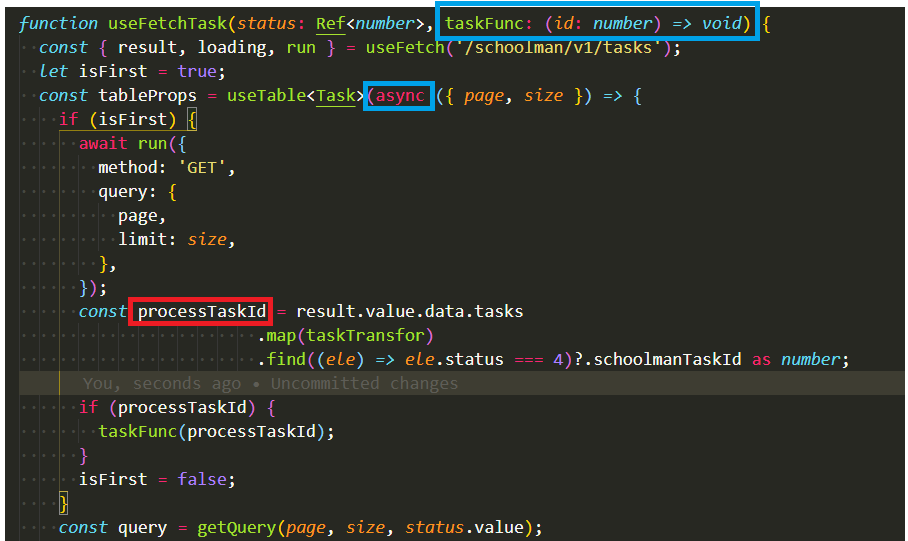

# 异步方法
想要得到异步方法执行后的值，只能在根据此值去执行一个方法，只能将想要执行的方法传入进去，因为我们是拿不到异步执行的那个值的，因为异步执行，结果不定。如下例子：  
  

&emsp;&emsp;当初想要将processTaskId导出去，因此在useTable外面定义了一个processTaskId，想要将useTable里面if(isFirst)里面执行的数据结果赋值给它，但是始终无法拿到异步函数体内改变后的值，只在内部可以拿到，出去之后的值依旧未改变。  
&emsp;&emsp;最初想要将此值从此方法中导出去，然后判断此值，再调用一个方法，结果拿到不到值，只能放弃。  
&emsp;&emsp;最后将要调用的方法传入进异步方法中调用，如此才能成功。
