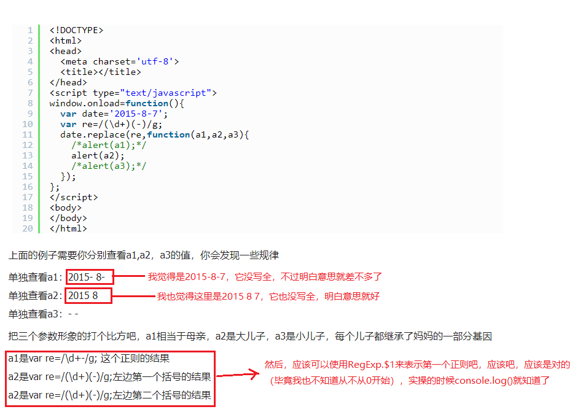

# 正则表达式/键码值
### <b><font color="red">正则表达式中的元字符必须转义，正则表达式中的元字符有：</font></b>  
<b><font color="red"> ( [ { \ ^ $ | ) ? * + .]} </font></b>   

```javascript
var pattern1 = /[bc]at/i;    // 这种是字面量形式的
var pattern2 = new RegExp("[bc]at", "i");  // 这种是RegExp构造函数形式的
上述两个完全是等价的。
```  
<br/>

<font color="blue"> 因为RegExp构造函数传入的两个参数都是字符串形式的，所以正则表达式中的元字符必须双重转义。</font>  

  

#### 一、正则表达式内^符号用法：
1、（限定开头）限定匹配输入的开始，如果多行标示被设置成了true，同时会匹配后面紧跟的字符：  
&emsp;&emsp;&emsp;&emsp;比如： /^A/会匹配"An e"中的A，但是不会匹配"ab A"中的A  
<font color="red">&emsp;&emsp;&emsp;&emsp;此时开头的A是被限定的（所以叫<font color="yellow">限定</font>匹配输入的开始）</font>  
2、（取反）这个字符出现在一个字符集合模式的第一个字符时，他将会有不同的含义。：  
&emsp;&emsp;&emsp;&emsp;比如：/[^a-z\s]/会匹配"my 3 sisters"中的"3"  
&emsp;&emsp;&emsp;&emsp;即：在[](或者我不知道的其他字符集合模式)中出现在第一位时，此正则表达式取反。  

#### 二、（）圆括号的用法：匹配一个集合,将匹配结果临时存储起来，供以后调用，但它还可以用作反向引用.
例：  
    

反向引用大概就是下图的意思：（看看就好，想认真再琢磨去）  
    

### 常用表达式<b><font color="red">校验规则</font></b>：
    
    

### 常用<b><font color="red">正则表达式</font></b>：
   
    
    
    
    
     

### <b><font color="red">键码值</font></b>：
     
     
     
     