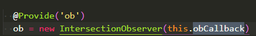
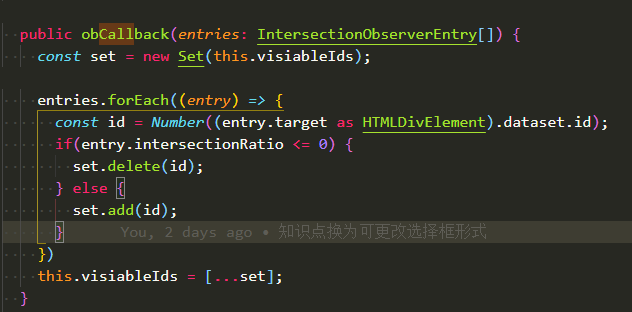
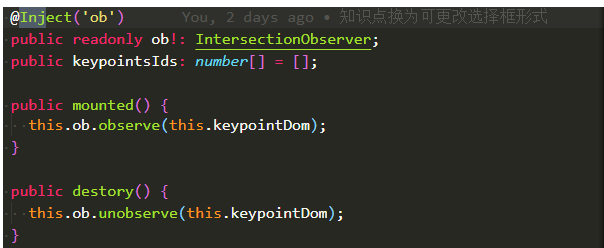

# 视口可见，滚动
```javascript
var io = new IntersectionObserver(callback, option);

// 开始观察
io.observe(document.getElementById('example'));

// 停止观察
io.unobserve(element);

// 关闭观察器
io.disconnect();

//开始观察的函数里面接收element元素
io.observe(elementA);
io.observe(elementB);

//entries是回调函数的参数，数个数组
var io = new IntersectionObserver(
  entries => {
    console.log(entries);
  }
	//在这里拿到的this不是VueComponent，而是当前的组件
 //（例，如果在XPaper组件中，此时的this指向的对象就为XPaper）
);
```
entries的每个成员都有这6个属性。
+ time：可见性发生变化的时间，是一个高精度时间戳，单位为毫秒
+ target：被观察的目标元素，是一个 DOM 节点对象
+ rootBounds：根元素的矩形区域的信息，getBoundingClientRect()方法的返回值，如果没有根元素（即直接相对于视口滚动），则返回null
+ boundingClientRect：目标元素的矩形区域的信息
+ intersectionRect：目标元素与视口（或根元素）的交叉区域的信息
+ intersectionRatio：目标元素的可见比例，即intersectionRect占boundingClientRect的比例，完全可见时为1，完全不可见时小于等于0  

例子：  
```javascript
function query(selector) {
  return Array.from(document.querySelectorAll(selector));
}

var observer = new IntersectionObserver(
  function(changes) {
    changes.forEach(function(change) {
      var container = change.target;
      var content = container.querySelector('template').content;
      container.appendChild(content);
      observer.unobserve(container);
    });
  }
);
//上段代码改写为自己熟悉的箭头函数的方式
var observer = new IntersectionObserver(
	changes => {
		chenges.forEach(change => {
			var container = change.target;
			var content = container.querySelector('template').content;
			container.appendChild(content);
			observer.unobserve(container);
		})
	}
)

query('.lazy-loaded').forEach(function (item) {
  observer.observe(item);
});
```
### 回调函数的具体样子：
```javascript
let callback =(entries, observer) => { 
  entries.forEach(entry => {
    // Each entry describes an intersection change for one observed
    // target element:
    //   entry.boundingClientRect
    //   entry.intersectionRatio
    //   entry.intersectionRect
    //   entry.isIntersecting
    //   entry.rootBounds
    //   entry.target
    //   entry.time
  });
};
```
正式开发写入的代码：  


