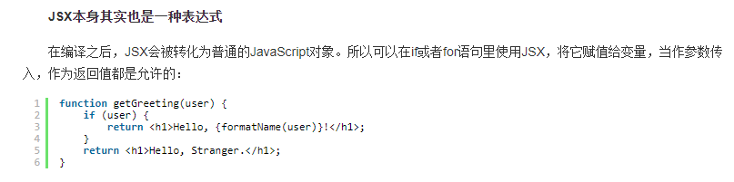
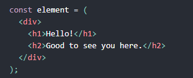

# JSX 
React中绑定属性值的时候，可以使用JSX中的<font color="red"><b>{}</b></font>来绑定动态的属性值，那么是否类似于在Vue中使用<font color="red"><b>:</b></font>来绑定动态的属性值，
```javascript
const element1 = ; // react
const element2 =  // vue
```
666啊，<font color="red">将JSX赋值给一个变量，可以做各种操作，例如：作为一个参数传入使用。代表自己可以在if语句与for语句中同样可以使用这个JSX做任何事情！！！</font>  

  

<font color="red"><b>JSX中可以使用任何js表达式，包括一个方法！！！如下：</b></font>

```javascript
const element = (
  <h1>
    hello, {formatName(user)}!
  </h1>
)
```  
<br/>

使用圆括号可以使一个JSX中包含很多内容：  

  