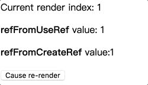
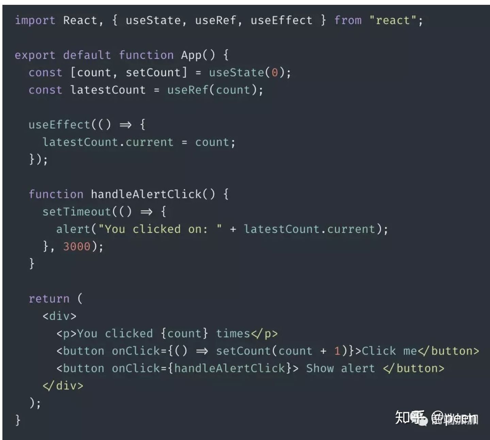

# useRef
转自<https://zhuanlan.zhihu.com/p/105276393>
## 什么是useRef
首先, 我们要实现一个需求 -- 点击 button 的时候 input 设置焦点.
#### createRef API 
 
同样的, 我们可以使用 useRef 来实现完全相同的结果.  
#### useRef Hook
   
从上面的例子看, createRef 和 useRef 的作用完全一样, 那为什么 react 要设计一个新的 hook ? 难道只是会了加上 use , 统一 hook 规范么?  

## createRef 与 useRef 的区别
事实上, 只要你认真读一下官方文档, 就会发现, 它们两个确实不一样.  

官网的定义如下:  

<code>useRef</code>returns a mutable ref object whose <code>.current</code> property is initialized to the passed argument (initialValue). The returned object will persist for the full lifetime of the component.  

换句人话说 , useRef 在 react hook 中的作用, 正如官网说的, 它像一个变量, 类似于 this , 它就像一个盒子, 你可以存放任何东西. <b>createRef 每次渲染都会返回一个新的引用，而 useRef 每次都会返回相同的引用</b>。  

如果你还不太理解, 没关系. 我们再用一个例子来加深理解 createRef 和 useRef 的不同之处.  
   
仔细看上面的代码. 它会输出什么 ?  

就算组件重新渲染, 由于 refFromUseRef 的值一直存在(类似于 this ) , 无法重新赋值. 运行结果如下:  

   
## 何时使用 useRef
为什么要设计 useRef 这个 API ? 我们来结合实际的应用场景来看看. 看一个经典的例子.  

   
你猜 alert 会弹出什么?  

是界面上 count 的实时状态 ? 还是在点击 button 时 count 的快照 ?  

   
最终结果是 在count为6的时候, 点击 show alert , 再继续增加 count , 弹出的值为 6, 而非 10.  

#### 为什么不是界面上 count 的实时状态?
实际的实现原理复杂得多, 此处可以先简单的理解成下面的普通函数执行.    
  
<b>当我们更新状态的时候,React 会重新渲染组件, 每一次渲染都会拿到独立的 count 状态, 并重新渲染一个 handleAlertClick 函数.</b> 每一个 handleAlertClick 里面都有它自己的 count .  

既然这样, 我们就理解了上面的例子, alert 出来的值, 就是当时点击时的 count 值.  

#### 如何让点击的时候弹出实时的 count ?
  

因为 useRef 每次都会返回同一个引用, 所以在 useEffect 中修改的时候 ,在 alert 中也会同时被修改. 这样子, 点击的时候就可以弹出实时的 count 了.  

   
上面的问题解决了, 我们继续, 我们希望在界面上显示出上一个 count 的值. 上代码. 上面的问题解决了, 我们继续, 我们希望在界面上显示出上一个 count 的值. 上代码.
  

 获取上一个值, 这在实际场景中并不少, 我们尝试把它封装成自定义 hook .  

   
 好了, 这样子我们就可以在函数式组件中方便的获取上一次的值. 这样, 我们就可以简单的实现类组件中 componentDidUpdate 获取 prevProps 的值了.   
     

## 总结
useRef 不仅仅是用来管理 DOM ref 的，它还相当于 this , 可以存放任何变量.  

useRef可以很好的解决闭包带来的不方便性.你可以在各种库中看到它的身影, 比如 react-use 中的 useInterval , usePrevious ……  

值得注意的是，当 useRef 的内容发生变化时,它不会通知您。更改.current属性不会导致重新呈现。因为他一直是一个引用 .  

