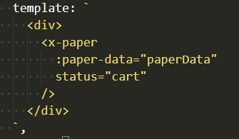
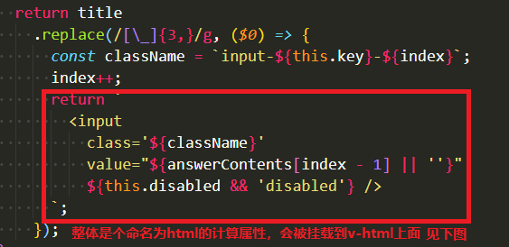
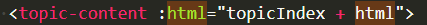
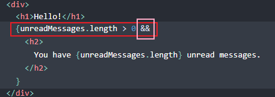

# vue与react的区别

### 1、
<b>vue中在\<template>\</template>标签中用``可以将他们编译为正常的HTML标签。</b>  

  
  
  

<b>但是在react中``只是被用作字符串显示</b>   
大概就是因为react中使用的是jsx吧，就直接写的是js，不需要再写成\`\`包含的字符串，然后再转为HTML了吧 

### 2、可以使用&&操作符当做vue里面的v-if
  

### 3、react中使用状态提升来让子组件共享数据，其实就是父组件将操作自身数据的一个方法传给子组件，让子组件调用父组件这个方法，改变父组件中state中的数据值。在vue中就可以直接emit一个null，然后在父组件中再写一个方法操作父组件中的数据就OK了。
