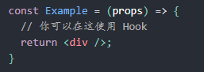
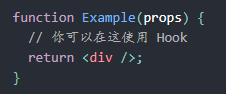

# 函数组件与class组件

## 函数组件
函数组件是这样的：  
  
也可以是这样的：  
  

上述函数组件也可用在vue中啊，使用上述两种方法定义函数。  
const 括号在中间，两边是等号，右边加箭头。  
function括号在旁边。  

Hook在class内部是不起作用的，但是可以使用Hook来取代class。  

## class组件
```javascript
// 函数组件
function Welcome(props) {
  return <h1>Hello, {props.name}</h1>;
}
```

```javascript
// class组件
class Welcome extends React.Component {
  render() {
    return <h1>Hello, {this.props.name}</h1>;
  }
}
```
这二者在react中是相等的