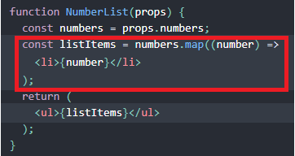
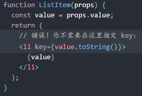
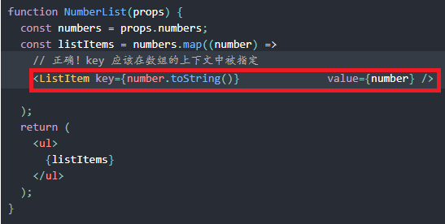
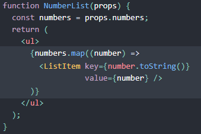

# 列表
初次见面，受到惊吓，竟然还可以这么写，React真的强大！！！JSX牛X。  

  

但是，还是跟Vue一样需要加上Key值作为唯一标志符。  

如果列表项目的顺序可能会变化，我们不建议使用索引来用作 key 值，因为这样做会导致性能变差，还可能引起组件状态的问题。所以最好是使用id来作为key值  

 

在哪里循环出来的，就在哪里写key值  
一个好的经验法则是：在 map() 方法中的元素需要设置 key 属性。  
例:  
  
   

数组元素中使用的 key 在其兄弟节点之间应该是独一无二的。然而，它们不需要是全局唯一的。当我们生成两个不同的数组时，我们可以使用相同的 key 值。  

上述例子简写：  
   