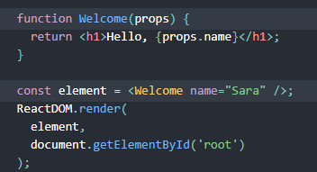
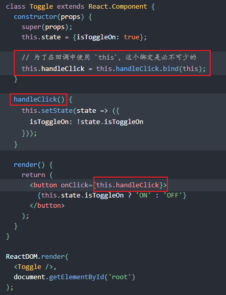
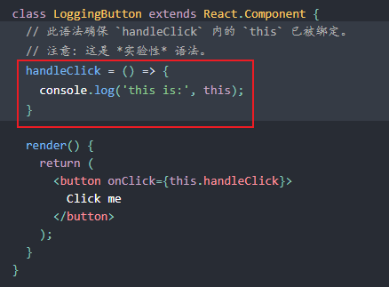
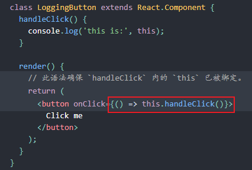
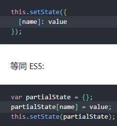

# 注意
### 1、因为 JSX 语法上更接近 JavaScript 而不是 HTML，所以 React DOM 使用 camelCase（小驼峰命名）来定义属性的名称，而不使用 HTML 属性名称的命名约定。  

例如，JSX 里的 class 变成了 className，而 tabindex 则变为 tabIndex。

### 2、React 会将以小写字母开头的组件视为原生 DOM 标签。例如，\<div /> 代表 HTML 的 div 标签，而 \<Welcome /> 则代表一个组件，并且需在作用域内使用 Welcome。<font color="red">React中组件名首字母必须的大写</font>


### State 的更新可能是异步的
出于性能考虑，React 可能会把多个 setState() 调用合并成一个调用。  

因为 this.props 和 this.state 可能会异步更新，所以你不要依赖他们的值来更新下一个状态。  

例如，此代码可能会无法更新计数器：
```javascript
// Wrong
this.setState({
  counter: this.state.counter + this.props.increment,
});
```
要解决这个问题，可以让 setState() 接收一个函数而不是一个对象。这个函数用上一个 state 作为第一个参数，将此次更新被应用时的 props 做为第二个参数：

```javascript
// Correct
this.setState((state, props) => ({
  counter: state.counter + props.increment
}));
```
上面使用了箭头函数，不过使用普通的函数也同样可以：
```javascript
// Correct
this.setState(function(state, props) {
  return {
    counter: state.counter + props.increment
  };
});
```


### 事件处理中需要为方法绑定this

  
如果觉得使用 bind 很麻烦，这里有两种方式可以解决。如果你正在使用实验性的 public class fields 语法，你可以使用 class fields 正确的绑定回调函数：  
<font color="red">(其实就是在class中使用箭头函数，将this在定义方法时就给确定了)</font>  

1、class fields  
  
2、回调中使用箭头函数：  
  
此语法问题在于每次渲染 LoggingButton 时都会创建不同的回调函数。在大多数情况下，这没什么问题，但如果该回调函数作为 prop 传入子组件时，这些组件可能会进行额外的重新渲染。我们通常建议在构造器中绑定或使用 class fields 语法来避免这类性能问题。  

### setState里的写法
  
