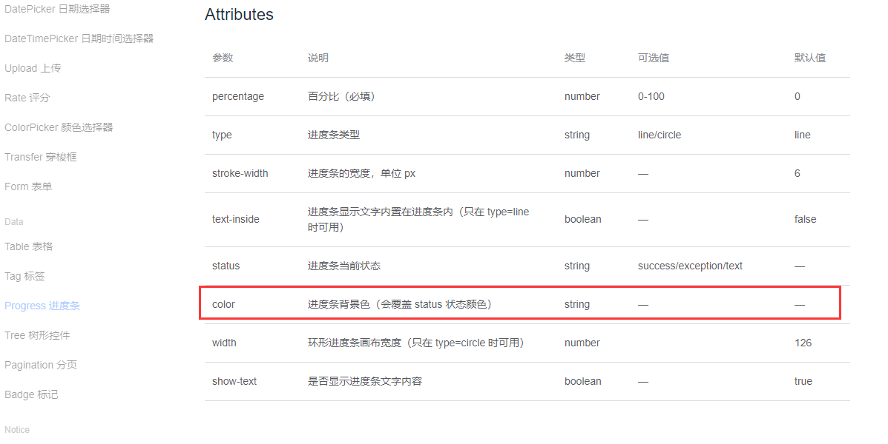
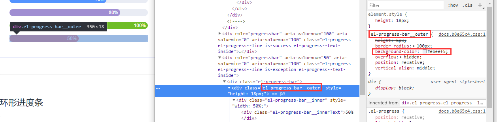
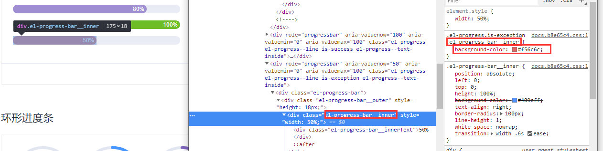
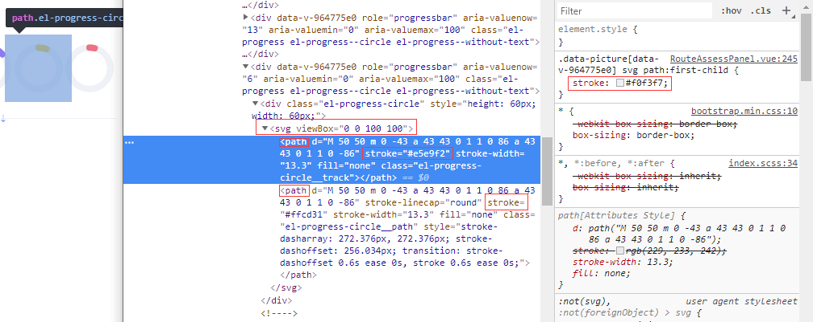
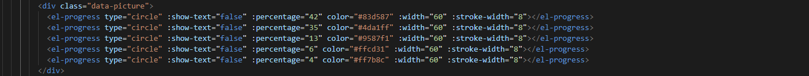
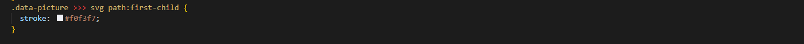

# El-Progress底色更改
ElementUI中Progress进度条组件官网给了如下属性：  
  
这里的color很好理解就是显示实际进度的颜色（个人觉得叫背景色不太好）。但是官网并没有给出设置底色的属性，只给了一个默认的颜色，F12看一下：  
  
  
条状的进度条很好理解，就是背景是(class="el-progress-bar__outer")的div，背景色是#ebeef5，表面的彩色进度就是(class="el-progress-bar__inner")的div；相应的颜色设置就通过class赋值就行了(ElementUI中直接赋值没有效果，需要获得盛放它的外部元素对象，然后利用“>>>” 进行赋值，其他组件也适用，详情看下面环形进度条代码例子)  
   
环状进度条是通过svg画出来的，其中包含两个\<path>,第一个就是底部的背景圆环图，第二个是彩色进度条圆环，这里设置颜色就不是background-color属性了，而是stroke属性；下面是我的例子  
   
   
这样就可以ok了。