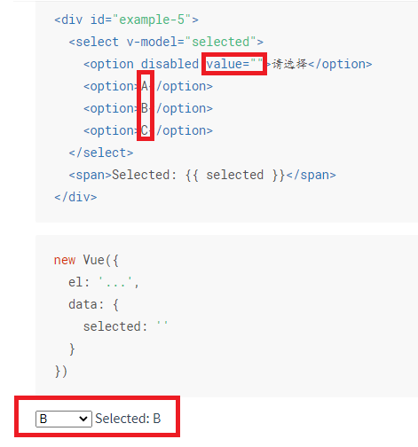
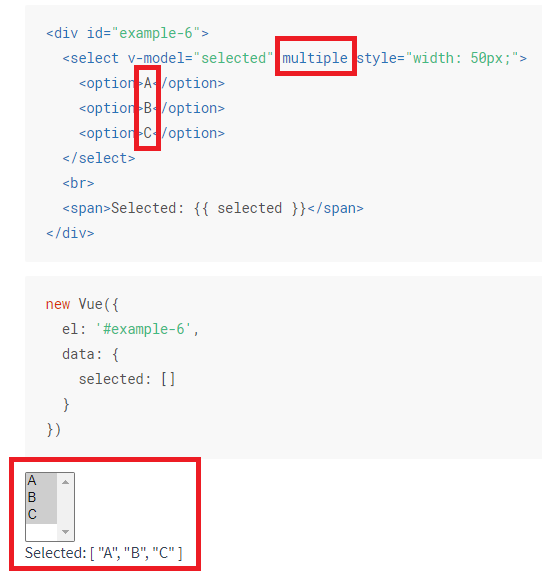
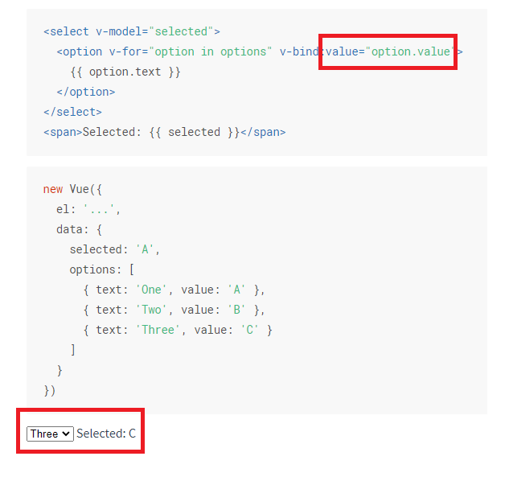
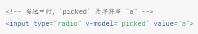

# v-model(2)
v-model只在表单元素中有效：  
+ text和textarea为【：value与@input】
+ checkbox和radio为【：checked与@input】
+ select将value作为prop并将change作为事件。
    - Select标签中的option标签没有写value之时，\<option>\</option>中间的文本就是v-model绑定的值：  
    单选时：    
      
    多选时：   
      
    
    - Select标签中的option标签上有value属性时，v-model绑定的便是value的值：  
       

input标签上type为checkbox，radio之时，当没有value是，v-model绑定的是布尔值（true/false）,有value之时，v-model绑定的是value的字符串：  
   

#### 它含有三个修饰符： 
1、.lazy  
2、.number  
3、.trim  
