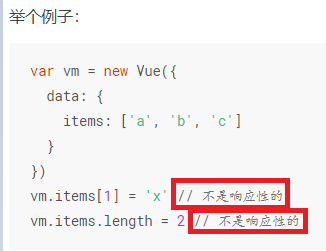
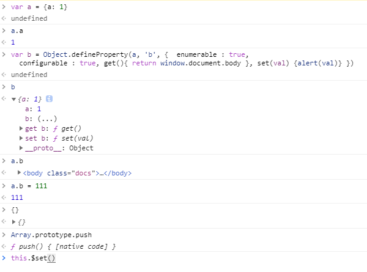
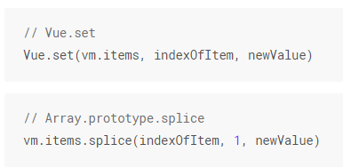
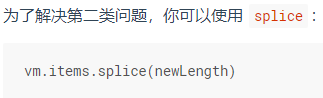

# Object.defineProperty的缺陷(2)
<b>数组通过下标或者.length修改数据 或者 对象新增或者删除属性，Object.defineProperty是拦截不到的，无法将新增的数据或者修改的数组数据变为响应式的。</b>  
数组响应只有push,pop,shift,unshift,splice,sort,reverse这七个操作数组的方式改变的才会响应。因为vue重写了这七个方法。  
API说明：  
  
  
示例：  
  
对于数组，想要使其响应，可以使用Vue.set(即this.$set)  
API文档说明：  
  
  
this.$set(
  想要改变的数组，
  数组中要改变的数据的索引，
  新值)  
数组长度改变使其响应可使用splice（此处的splice与数组中的splice不同，可打印查看：Array.prototype.splice....(忘了，另行查阅打印的相关知识)）  
  

### 使用typescript定义响应式数据：
&emsp;&emsp;@ Prop()  
&emsp;&emsp;public XXX!: number;  
&emsp;&emsp;此时的XXX是默认是@Prop()有传给它值，编译时是存在的，其值改变，vue会响应重新渲染dom。  
&emsp;&emsp;但是定义以下：  
&emsp;&emsp;public XXX!: number;  
&emsp;&emsp;此刻的XXX是undefined，编译之时它不存在，不是响应式的，就算之后给其赋值，更改其值，因为不是响应式的，vue也不会响应重新渲染dom