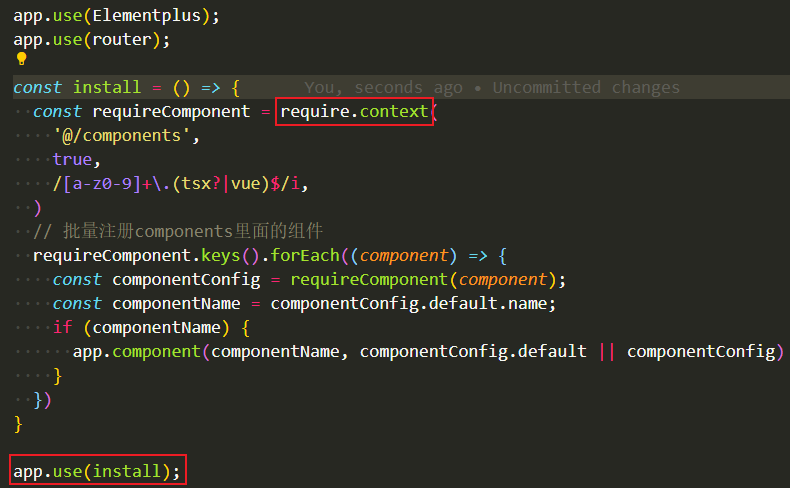

# 批量注册全局组件(2)  
  

<b>require.context是webpack中的方法，相当于export跟import。</b>  

使用方法：  
require.context( directory,  useSubdirectories,  regExp )

1. directory: 要查找的文件路径
2. useSubdirectories: 是否查找子目录
3. regExp: 要匹配文件的正则

<b>具体的用法再百度吧，因为看了一遍没看懂，（发现在vueAPI文档中就有写）</b>