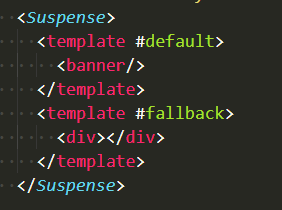
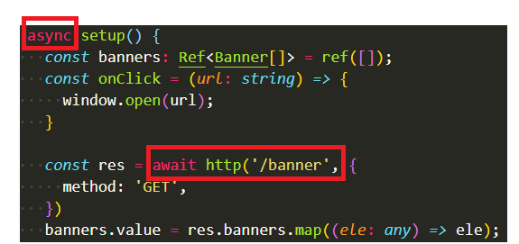
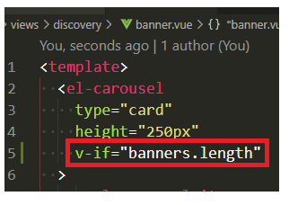
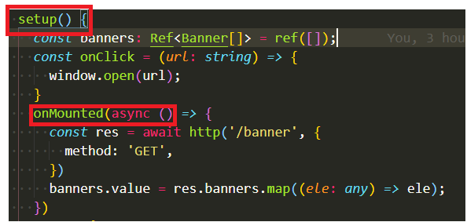

# suspense(3)
又在生命周期上面踩坑，哇咔咔，vue2中就有踩过这个坑，如今记不住教训，再次踩坑。
需要在页面上渲染的组件数据，必须在页面渲染前得到这个数据，所以必须在mounted之前拿到需要在页面上渲染的数据，所以created请求接口，拿到数据，且必须这么做。  
但是在vue3中，setup里面就是created的生命周期。所以只能让这个组件变成异步组件了。  

如下：  
（1）setup前面加上async，然后在父组件中使用suspense标签包裹。  
或者另一种方法：  
（2）在最外面，就是要渲染这个组件的最外层，加上v-if。
实例： 
（1）的实例：  
父组件：  
  
子组件：  
  

（2）的实例：
只在子组件中操作：  
  
  