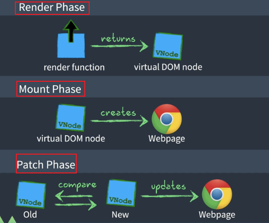

# vue-mini(3)
(未写完，待补充)
### 整体流程：
&emsp;&emsp;RenderPhase: 利用初始化数据生成虚拟Dom节点（当然也是渲染函数生成的虚拟节点）。  
&emsp;&emsp;MountPhase（准备阶段？，【自我翻译，见笑】）：将虚拟Dom节点创建成为真实的Html（自己的话，原话这样说的：利用虚拟Dom创建视图页面Html）。  
&emsp;&emsp;PatchPhase（打补丁阶段？【自我翻译，哈哈】）： 响应性数据（数据模型）一旦发生变化，渲染函数将再次被调用生成虚拟Dom，然后调用diff算法，比较不同再更新真实Html  

渲染函数功能就是生成虚拟Dom节点。

### 三大模块的分工：
Reactivity Module： 数据响应式模块  
Compiler Module： 编译器  
Renderer Module： 渲染函数   

<b>1、数据响应式模块：</b>  
&emsp;&emsp;提供 创建一切数据  只要发生改变  都是可以被监听的 方法。————> 响应式对象，响应式原理。  

<b>2、编译模块：</b>  
\<template>:叫做模板，它是Html5里面新定义的标签。平时就叫做Html模板。  
此模块干的工作是：  
&emsp;&emsp;将Html模板编译为渲染函数，这个编译过程可以在浏览器运行时，或者Vue项目打包编译时执行。  
模板编译的主要目的就是生成渲染函数。而渲染函数的作用是每次执行它，它就会使用当前最新的状态生成一份新的vnode，然后使用这个vnode进行渲染  

<b>3、渲染函数：</b>   
通过下图三个周期将视图渲染到真实页面上。  

