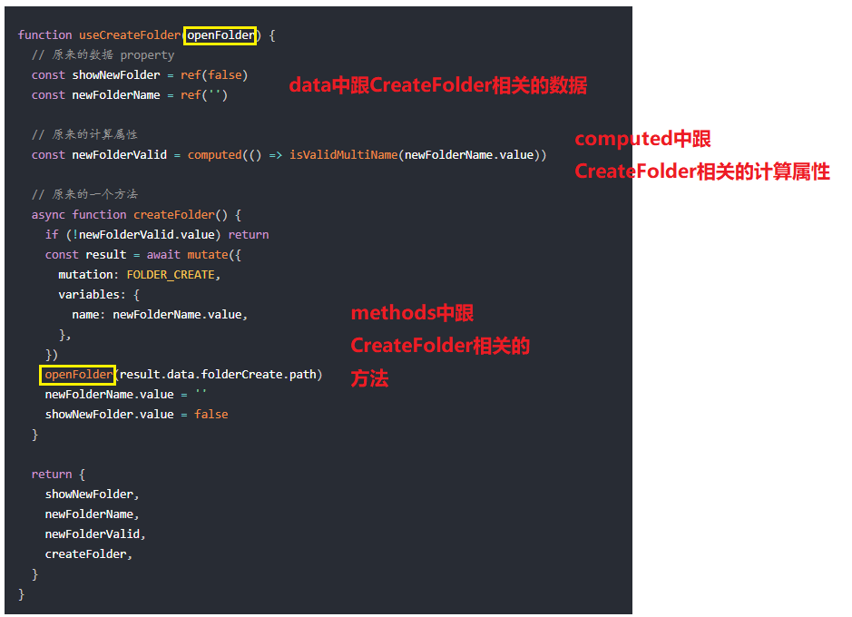

# compositionApi(组合式API意见稿) 

### <b><font color="red">一、reactive</font></b> 是响应式（可看做Vue中的data），在 Vue 中，响应式状态的基本用例就是在渲染时使用它。  

```javascript
const state = reactive({
  count: 0,
})
```  
因为<font color="red">响应式</font>，所以就有了<font color="red">依赖追踪</font>，视图会在响应式状态发生改变时自动更新。但在<font color="red">DOM 当中渲染内容</font>会被视为一种<font color="red">“副作用”</font>  

### <b><font color="red">二、watchEffect</font></b>  基于响应式状态的副作用自动进行<font color="blue">重应用（自动换值时渲染页面）</font>  
```javascript
watchEffect(() => {
  document.body.innerHTML = `count is ${state.count}`
})
``` 

### <b><font color="red">三、computed 计算属性</font></b>
执行原理：  
```javascript
function computed(getter) {
  let value
        watchEffect(() => {
          value = getter()
  })
  return value
}
```
<font color="red">&emsp;&emsp;上述是错误的</font>，如此，响应式会失去响应，  
&emsp;&emsp;value 是一个例如 number 的基础类型，那么当被返回时，它与这个 computed 内部逻辑之间的关系就丢失了！这是由于 JavaScript 中基础类型是值传递而非引用传递。  
<font color="red">&emsp;&emsp;下面是对的工作原理：</font>   
&emsp;&emsp;为了确保始终可以读取到最新的计算结果，我们需要将这个值上包裹到一个对象中再返回（ 所以我们每次拿到计算属性的值都必须得写 .value( 解开ref后就不需要了 ) ）  
&emsp;&emsp;另外我们同样需要劫持对这个对象 .value property 的读/写操作，来实现依赖收集与更新通知  

  

<font color="red">const double = computed(() => state.count * 2)</font>  
这里的<b><font color="red">double</font></b>是一个对象，我们叫它<font color="red">ref</font>，解开ref有两种方法，感觉第二种比较简单，就只描述第二种的方法了，第一种再回去看API文档吧  

<font color="red">1、当一个 ref 值嵌套于响应式对象之中时，访问时会自动解开</font>  
 
   

### 四、
<b><font color="red">简单版使用：（下列代码所写的并不是在组件实例上存在）</font></b>  

    

貌似这二者工作相同：  
    
    

<b><font color="red">下列代码才是在组件实例上存在，二者效果相当</font></b>   
    

### <b><font color="red">五、生命周期钩子的使用方法：</font></b> 
直接放入setup（）方法中就好  
   

### <b><font color="red">六、代码组织使用方法：</font></b>   
<b>实例如下：</b>  

一个如下：  
   

一群如下：  
   

最后如下：  
   
setup() 函数现在只是简单地作为调用所有组合函数的入口：  

<br/>
reactive为了保证响应式，建议如下写：加上toRefs（），不然解构或者展开会使其失去响应式。  

   