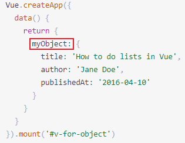
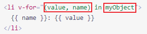

# v-for
可以用of  也可以用in，二者有区别，  
后面的数据可以是数组，可以是对象可以是数字，需要改变时可以是计算属性，可以是方法  
数字：为数字时，从1开始；  
计算属性：（原数组不能改变）  
  

一个方法：（下面的set是sets中的数，不能用计算属性，那么便可以试试用方法，原数组不可改变）    
  

对象：  
&emsp;&emsp;只有一个参数时表示property的值（也就是
Value）  
  
  

result：  
  

有两个参数时，第二个表示property的名称（也就是Key）  
  
  

第三个参数是索引  
  
   

为了给 Vue 一个提示，以便它能跟踪每个节点的身份，从而重用和重新排序现有元素，你需要为每项提供一个唯一 key 。