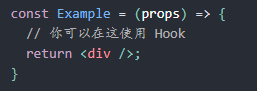
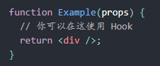
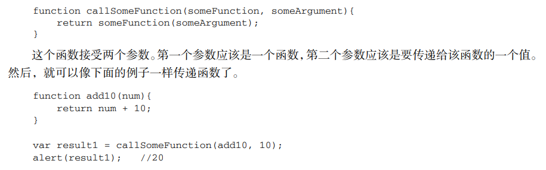
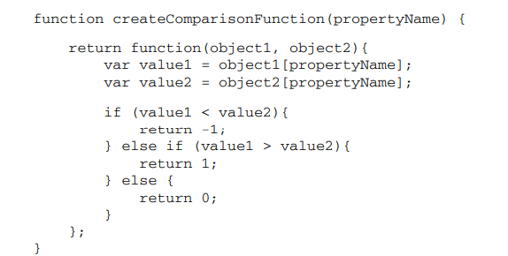

# 函数组件
函数组件是这样的：  
  
也可以是这样的：  
  
上述函数组件也可用在vue中啊，使用上述两种方法定义函数。  
const 括号在中间，两边是等号，右边加箭头。  
function括号在旁边。  

<br/>  
主要原因是因为<font color="red">函数实际上是对象</font>，每个函数都是 Function 类型的实例，而且都与其他<font color="red">引用类型</font>一样具有属性和方法因此函数名实际上也是一个指向函数对象的指针，不会与某个函数绑定。函数通常是使用<font color="red">函数声明</font>语法定义的，如下面的例子所示。  

```javascript
function sum (num1, num2) {
  return num1 + num2;
}
```
这与下面使用<font color="red">函数表达式</font>定义函数的方式几乎相差无几。 

```javascript
var sum = function(num1, num2){
  return num1 + num2;
};
```
以上代码定义了变量 sum 并将其初始化为一个函数。有读者可能会注意到，function 关键字后面没有函数名。这是因为在使用函数表达式定义函数时，没有必要使用函数名——通过变量 sum 即可以引用函数。另外，还要注意函数末尾有一个分号，就像声明其他变量时一样。

<br/>

实际上，解析器在向执行环境中加载数据时，对<font color="red">函数声明</font>和<font color="red">函数表达式</font><font color="blue">并非一视同仁</font>。解析器会率先读取函数声明，并使其在执行任何代码之前可用（可以访问）；至于函数表达式，则必须等到解析器执行到它所在的代码行，才会真正被解释执行。   

<br/>

在代码开始执行之前，解析器就已经通过一个名为<font color="red">函数声明提升</font>（function declaration hoisting）的过程，读取并将函数声明添加到执行环境中。对代码求值时，JavaScript引擎在第一遍会声明函数并将它们放到源代码树的顶部。所以，即使声明函数的代码在调用它的代码后面，JavaScript 引擎也能把函数声明提升到顶部。  

<font color="blue">除了什么时候可以通过变量访问函数这一点区别之外，函数声明与函数表达式的语法其实是等价的。</font>  

因为 ECMAScript 中的函数名本身就是变量，所以函数也可以作为值来使用。也就是说，<font color="red">不仅可以像传递参数一样把一个函数传递给另一个函数，而且可以将一个函数作为另一个函数的结果返回。</font>  

1、将一个函数作为值传入：  
  

2、将一个函数作为结果返回：  
    

```javascript
(function() {
      // 块级作用域（即私有作用域，外部是不可访问到的）
})()
```

上面这样定义函数是对的，他就相当于：  
```javascript
var someFunc = function() {
// 块级作用域
}
someFunc();
```
而且 <font color="red">function() {    }()是错的</font>，因为<font color="red">只有函数表达式后才可以跟圆括号</font>，函数声明转换成函数表达式仅需要给函数声明加上圆括号，即(function() {  })()。
```javascript
function outputNumbers(count){
     (function () {
         for (var i=0; i < count; i++){
         alert(i);
     }
     })();
 alert(i); //导致一个错误！因为i在私有作用域中，外部访问不到。
} 
```