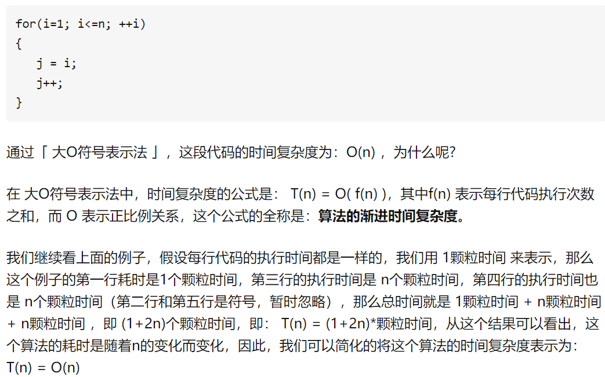

# 时间复杂度
### 时间维度：
是指执行当前算法所消耗的时间，我们通常用「时间复杂度」来描述。

#### 常见的时间复杂度：
+ 常数阶：O(1);
+ 对数阶：O(logN);
+ 线性阶：O(n);
+ 线性对数：O(nlogN);
+ 平方阶：O(n^2);
+ 立方阶：O(n^3);
+ K次方阶：O(n^k);
+ 指数阶：O(2^n);  

从上到下一次的时间复杂度越来越大，执行的效率越来越低。  

#### O表示正比例关系。
  

#### 线性阶：
```javascript
for (let i = 0; i < n; i++),   
```
上面一行代表此行代码要执行n次，所以，时间复杂度为O(n)，如果上面的n换成m，则时间复杂度为O(m)。

#### 对数阶：
```javascript
let i = 0;
while(i < n) {
  i = i * 2;
}
```
上述代码的大致可以写为：  
i = i * 2 * 2 * 2 * 2  *2 ......,循环x遍之后i无限趋近于n；  
所以最后该省略的省略后可写为：  
2^x = n; (2的x次方等于n)  
要求此x的值；则为：  
x = log(2)N; log以2为底N的对数。  
<font color="blue">也就是说循环log(2)N次之后就结束了</font>，因此时间复杂度为O(logN);  

#### 线性对数阶：
```javascript
let c = 0;
for (let i = 0; i < n; i++) {   
  while(c < n) {
    c = c * 2;
  }
}
```
上述就是<font color="blue">将时间复杂度为O(logN)的程序循环了n遍</font>，所以整个的时间复杂度便是nO(logN)，又可以写为O(nlogN);  

#### 平方阶：
```javascript
for(let i = 0; i < n; i++) {
  for(let j = 0; j < n; j++) {
    ...
  }
}
```
上述意味着将时间复杂度为n的程序再执行n遍，那不就是n^2吗。  

如果是  
```javascript
for（let i = 0; i < n; i++） {
  for(let j = 0; j < m; j++) {
    ...
  }
}
```
此时的时间复杂度则是O（n * m）；  

立方阶与k次方阶都可以参照平方阶来理解。  