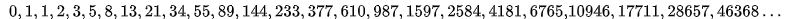

# 有关数学
斐波那契数列：  
斐波那契数列指的是这样一个数列：  
  
这个数列从第3项开始，每一项都等于前两项之和。  

### Math.PI为π也为180度。
可推导：  
圆心角度数为弧度与半径的比。  
所以：  
2πr = 圆周；  
πr = 半圆周；  
1度 = （半圆周 / 180度）/ r；  
推导：  
1 = （πr / 180）*  1 / r；  
π = 180；  
