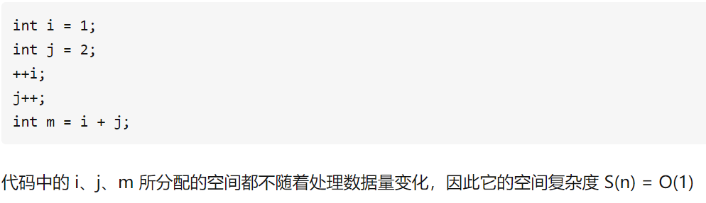
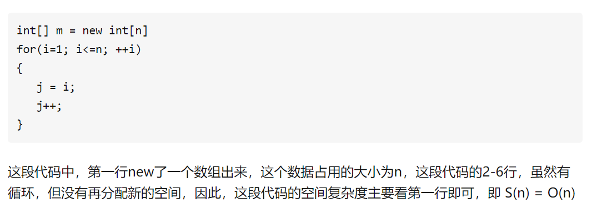

# 空间复杂度
### 空间维度：
是指执行当前算法需要占用多少内存空间，我们通常用「空间复杂度」来描述。  

空间复杂度是对一个算法在运行过程中临时占用存储空间大小的一个量度，同样反映的是一个趋势，我们用 S(n) 来定义。  

#### 常用空间复杂度：
+ O(1);
+ O(n);
+ O(n^2);  

#### 空间复杂度O(1):
  

#### 空间复杂度O(n)
   

说空间复杂度的计算比时间复杂度的计算简单，所以不要想的复杂了。