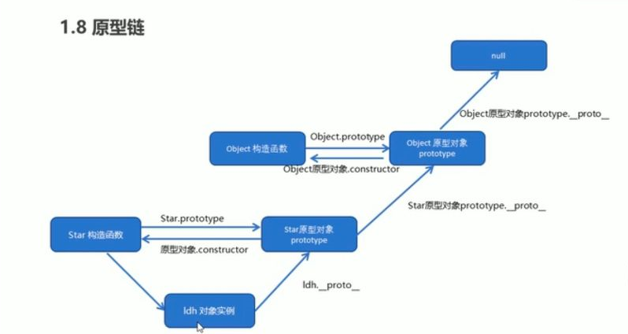

# javascript(含es6)

## 闭包
<font color="red">简单来说就是函数中嵌套着的函数。</font>  
上句话存在以下三个深入问题  

1.  为什么非闭包函数没有权限访问其他函数作用域内部变量？
2.  为什么闭包有这个权限？
3.  什么是函数作用域？  

+ 回答：  
    - 在js中，变量的作用域属于函数作用域，在函数执行后作用域会被清除。内存也会被回收，但是由于闭包是建立在一个函数内部的子函数，由于其可访问上级作用域的原因，即使上级函数执行完毕，作用域也不会随之销毁，这时的子函数————也就是闭包，便拥有了访问上级作用域中的变量的权限，即使上级函数执行完毕后作用域内的值也不会被销毁。
4.  闭包解决了什么问题  
    - 阮一峰日志回答：~~本质上，闭包就是将函数内部和函数外部连接起来的一座桥梁~~
    - 上面解释比较含糊，可以这么来说：   
    - 由于闭包可以缓存上级作用域，那么就使得外部函数可以访问内部函数的变量。
5. 闭包常用场景  
    ```javascript
    for(var i = 0; i <= 3; i++) {
      setTimeout(() => console.log(i), 0)
    }
    // 最终输出结果 3,3,3
    ```
    使用闭包就可让上级作用域不被销毁，就能取得正确的值

## 构造函数
用来初始化新创建对象的函数就是构造函数
## 原型链
+ <b>基本思想：</b>通过原型继承多个引用类型的属性和方法  
+ <b>原理：</b>因为每个构造函数都有一个原型，原型对象有一个contructor属性指回构造函数，而对象实例有一个__proto__属性指向原型，所以，如果一个原型是另一个对象的实例，那就意味着这个原型本身就有一个内部的__proto__指针指向另一个原型，那另一个原型又有contrcutor属性指回一个构造函数。就这样，实例跟原型之间构造了一条原型链。  
+ <b>原型链继承的优点：</b>通过原型链继承的方式，原先存在父类型的实例中的所有属性和方法，现在也能存在于子类型的原型中了。  
  

## 继承
原型链继承：让新实例的原型等于父类的实例。  
盗用构造函数继承：用call和apply将父类构造函数引入子类函数  
组合继承：继承了原型上的属性和方法也继承了父类实例的属性。  

## class
类是对象的模板，定义了同一组对象共有的属性和方法。通过class关键字，可以定义类。  
ES6的calss可以看做是一个语法糖，它的绝大部分功能，ES5都可以做到，新的class写法只是让对象原型的写法更加清晰、更像面向对象编程的语法而已。  
定义一个类，里面有constructor（）构造函数方法，使用this关键字代表实例对象。在里面定义方法的时候不需要加上function这个关键字。  
使用的时候也是直接使用new关键字，跟构造函数用法完全一致。  
事实上，类的所有方法都定义在类的prototype属性上面。
类的方法都定义在prototype对象上面，所以类的新方法可以添加在prototype对象上面。Object.assign()方法可以很方便地一次向类添加多个方法。  
在子类的构造函数中，只有调用super之后，才可以使用this关键字，否则会报错。这是因为子类实例的构建，基于父类实例，只有super方法才能调用父类实例。 

## Promise
&emsp;&emsp;promise是一个构造函数，通过构造函数来生成promise的实例。  
&emsp;&emsp;它有三种状态，等待，完成，失败，构造一个promise实例需要给Promise构造函数传入一个函数，传入的函数需要有两个形参，两个形参都是function类型的参数，分别是resolve和reject。Promise上还有then方法，then方法就是用来指定Promise对象的状态改变时确定执行的操作，resolve时执行第一个函数，reject时执行第二个函数。当状态一旦变为resolve时就不能变为reject，反之同理。  
&emsp;&emsp;promise是对回调函数的一种封装，是对异步编程的一种改进，传统的异步编程使用回调函数，而回调函数嵌套过多就会导致回调地狱。我们可以用promise将自己的程序以同步的方式表达出来，从而解决代码可读性差的问题。

## promise怎么做异常处理：

有两种方法处理异常：  
1、reject回调，就是then里面的第二个参数。在这里如果不抛出异常，异常就会被吞掉，catch也无法捕获，如果抛出异常就会被下一个then的reject回调处理，大多情况下不是我们想要的。   
2、catch里面捕获异常并处理。  
## 垃圾回收机制有
标记清理跟引用计数的两种方式  
<b>标记清理:</b>  
变量进入上下文时给它打上标记，然后将有用的变量释放掉，剩下的就是不再使用的变量了，就把他们占用的内存回收掉，  
<b>引用计数:</b>  
跟踪标记每一个值被引用的次数，当它的引用次数为0时就把它回收掉，但是它会存在互相引用的问题，导致引用次数永远不为0，就算代码执行完毕离开了作用域，他们的引用依旧存在，然后就无法回收，如果有大量的这种互相引用，就会造成内存大量泄漏。

## this指向
总的来说this永远指向的是最后调用它的对象，也就是看它执行的时候是谁调用的  
<b>箭头函数：</b>  
如果是箭头函数，则为第一个包裹箭头函数的普通函数的this指向  
<b>bind，call，apply</b>  
如果不是箭头函数，但是使用了bind，call，apply改变this的方法，this被重新绑定为bind，call，apply函数的第一个参数。  
<b>如果是普通函数，并且没有绑定this</b>  
+ 如果是用new的方式调用，this被绑定到实例上，
+ 如果被调用，谁调用指向谁，
+ 如果直接执行，this指向window

## apply  call 那个性能好一点
他们都是函数运行时改变this指向。  
apply第二个参数是一个数组，  
call第二个参数是一个个列举出来。  
<b>call比apply的性能稍微好一点（当参数传递超三个时），使用call更多一点</b>
## 箭头函数的缺点
因为箭头函数的this取决于上一级作用域，  
缺点一就是this被定义好了，  
缺点二就是太简洁有时难以阅读。  
下面这些情景就会出现问题：  
1、在对象中定义方法的时候，用箭头函数且里面用了this。  
2、在原型链上定义方法时，用箭头函数且里面使用了this。  
3、在需要动态上下文时，用了箭头函数且用了this。  
4、在构造函数内部用了箭头函数，且用了this，那么这个this已经被定义好了，不会指向它的对象实例。  

## async await
async 会返回一个promise，await是等待，如果等到一个promise，它会阻塞后面代码，等待promise对象resolve，然后得到一个resolve的值，作为await表达式的结果运算。

## 解构
按照一定模式，从数组和对象中提取值，对变量进行赋值，这被称为解构

## 扩展运算符
用于取出参数对象中的所有可遍历属性，拷贝到当前对象之中，  
扩展运算符对对象实例的拷贝属于一种浅拷贝  

## 宏任务，微任务
js是单线程执行，分有主线程跟任务队列，执行任务时，会先把主线程上的所有同步任务执行完毕，然后就去查找有没有微任务，有的话就执行，执行完微任务之后就去查找宏任务，执行宏任务。  
promise是宏任务，但他的回调函数是微任务。  
setTimeout回调也是微任务。 

## 数组：一组有序的数据
## map，for each
map如果不返回，它会默认返回一个undefined的数组，  
for each默认返回一个undefined。
## 深拷贝，浅拷贝
#### 浅拷贝：
仅仅是指向被复制的内存地址，如果原地址发生改变，那么复制出来的对象也会相应的改变  
<b>Object.assign()</b>，进行浅拷贝，当源对象只有一层时，是深拷贝。  
<b>Array.prototype.concat()，Array.prototype.slice()</b>数组的concat与slice不会修改原数组，只会返回一个浅拷贝了原数组中元素的一个新数组。  
#### 深拷贝：
在计算机中开辟一块新的内存地址用于存放复制的对象

+ <b>JSON.parse(JSON.stringify())</b>  
&emsp;&emsp;用JSON.stringify将对象转成JSON字符串，再用JSON.parse()把字符串解析成对象，一去一来，新的对象产生了，而且对象会开辟新的栈，实现深拷贝  
&emsp;&emsp;这种方法虽然可以实现数组或对象深拷贝，但对象或数组中有函数是不能处理的。因为 JSON.stringify() 方法是将一个JavaScript值(对象或者数组)转换为一个 JSON字符串，不能接受函数。  

+ <b>自己手写一个递归方法：</b>  
&emsp;&emsp;递归方法实现深度克隆原理：遍历对象、数组直到里边都是基本数据类型，然后再去复制，就是深度拷贝。
+ <b>函数库lodash：</b>  
&emsp;&emsp;该函数库也有提供 _.cloneDeep 用来做 Deep Copy。

