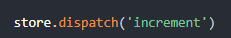

# vue
## 对vue的理解
<b>关键点：</b>渐进式 JavaScript 框架、核心库加插件、动态创建用户界面  
<b>特点：</b> MVVM 模式；代码简洁体积小，运行效率高，适合移动PC端开发；本身只关注 UI （和 react 相似），可以轻松引入 Vue 插件或其他的第三方库进行开发

## MVVM，详细说说
全称： Model-View-ViewModel ， Model 表示数据模型层。 view 表示视图层， ViewModel 是 View 和 Model 层的桥梁，数据绑定到 viewModel 层并自动渲染到页面中，视图变化通知 viewModel 层更新数据。

## vue是如何实现响应式数据的
+ vue将data初始化为一个Observer并对对象中的每个值，重写了其中的get、set，data中的每个key，都有一个独立的Dep
+ 在get中，向Dep添加了监听
+ 在mount时，实例了一个Watcher，将Dep的目标指向了当前Watcher
+ 在data值发生变更时，触发set，触发了Dep中的所有监听的更新，来触发Watcher.update  
### Observer：
定义对象间的一种一对多的依赖关系,当一个对象的状态发生改变时, 所有依赖于它的对象都得到通知并被自动更新。  

数组通过下标更改数据或者对象进行属性添加是无法更改视图的，因为Object。defineProperty无法拦截这些操作，所以vue内部重写了可以修改数组数据的pop，push，unshift，shift，splice，sort，reverse这些个方法解决了这个问题。 

vue3使用了代理：
代理可以直接监听对象数组的变化。

## 观察者模式与发布订阅者模式
#### 观察者模式是为了实现松耦合，
就是个Observer，当某个数据发生变化，依赖于它的方法都会被调用。
多用于单个应用内部
#### 发布订阅者模式完全不存在耦合
发布订阅模式里面，除了发布者，订阅者，还有经纪人的角色，他们之间的通信是通过经纪人这个角色来传达的。  
更多的是一种跨应用模式，比如消息中间件。  
<b>例子：</b>  
发布者只需告诉Broker，我要发的消息，topic是AAA；  
订阅者只需告诉Broker，我要订阅topic是AAA的消息；  
于是，当Broker收到发布者发过来消息，并且topic是AAA时，就会把消息推送给订阅了topic是AAA的订阅者。当然也有可能是订阅者自己过来拉取，看具体实现。

## object.definedProperty的局限性。
无法检测到对象属性的新增或删除，  
无法监听到数组的变化。  
所以vue把无法监听数组的情况通过重写数组的部分方法来实现响应式。  
vue3使用了代理：用于修改某些操作的默认行为。就是在目标对象之前做一层拦截，外部的所有访问都必须经过这层拦截。这层拦截可以做很多事情，比如对数据进行过滤修改或者收集信息之类

## 计算属性vs侦听属性vs方法
计算属性有缓存，只有在响应式依赖变更时才会变更，  
计算属性为什么需要缓存，就是为了提高性能，假设有一个性能开销比较大的计算属性，它需要遍历一个巨大的数组做大量计算，然后有其他属性依赖于A，如果没有缓存，就不可避免的多次执行A的getter。  
然后methods是没有缓存的，只要重新渲染，就会再次执行。  

计算属性默认只要getter，不过需要也可以提供setter，watch是，当数据变化之后需要执行异步函数或者开销较大的操作时，使用watch
## v-model中的实现原理及如何自定义v-model 
v-model本质就是value+input事件的语法糖，原生的v-model会根据input标签的不同生成不同的事件与属性，解析一个指令来。  
自己定义的model属性，里面放prop跟event。

## v-for的key的作用
key的主要作用就是用来提高渲染性能的！  
在用v-for更新已渲染的元素列表的时候，会使用就地复用的策略；这就是说列表数据修改的时候，他会根据key值去判断某个值是否修改，如果修改了就重新渲染，不然就复用之前的元素。  
示例就是：比如在列表数据中间插入一条数据，如果没有key的话，会让数据混乱，如果用index为key的话会让这条数据，以及之后的数据都重新渲染一次，渲染性能浪费了。如果用个唯一值作为key的话，就只会渲染插入的这条数据。

## 为何data必须是一个函数
防止组件重用时导致数据互相影响。实例化这个组件的时候，如果data不是函数的话，那就每个组件的实例结果就都一样了，可以说是共享了，而且在一个地方改了数值，那么另一个地方的这个数值也会被改掉。但是如果data是个函数的话，这个data都在闭包中，不会互相影响。
## mixin 抽离组件相同逻辑
<b>缺点：</b>  
1、变量来源不明，不利于阅读  
2、多mixin可能造成命名冲突  
3、xixin跟组件之间可能出现多对多的关系：一个组件引用多个mixin，一个mixin被多个组件引用，复杂度较高，很容易剪不断理还乱。

## 生命周期
先开始new Vue，初始化了一个vue空实例对象之后就调用beforeCreate钩子函数，然后进行了数据观测以及一些属性和方法的运算，实例已被创建完成，之后调用created钩子函数，然后Vue开始编译模板，最终在内存中生成了一个编译好的模板字符串，渲染为内存中的DOM，此时只是在内存中，还没有挂载，然后就调用beforeMount钩子函数，然后将内存中编译好的模板真实的替换到浏览器的页面中去，挂载完成了，然后就调用了mounted钩子函数，此时vue实例已经初始化完毕了，开始运行，运行中当数据发生更改后，就会调用beforeUpdate钩子函数，然后根据data中的数据在内存中重新渲染出一个新的DOM树，然后重新渲染到真实页面中去，真实页面更新完毕之后调用了updated钩子函数，在页面运行完毕打算销毁就调用beforeDestroy，这个时期实例上的所有东西都还存在，之后开始销毁实例，那些watchers，子组件，事件监听之类的都销毁完毕之后，就是实例被销毁之后执行了destroyed。  

+ beforeCreate：实例初始化之后，数据观测之前调用  
+ created：实例创建完成后立即被调用，数据观测 (data observer)，+ property 和方法的运算， watch/event 事件回调已完成。
+ beforeMounte：实例被挂载前调用
+ mounted：实例被挂载后调用，注：mounted 不会保证所有的子组件也都一起被挂载。如果你希望等到整个视图都渲染完毕，可以在 mounted 内部使             用 vm.$nextTick：
+ beforeUpdate：数据更新时调用发生在虚拟DOM打补丁之前
+ updated：钩子被调用时，DOM已更新。注意 updated 不会保证所有的子组件也都一起 
  被重绘。如果你希望等到整个视图都重绘完毕，可以在 updated 里使
  用 vm.$nextTick：
+ activated：被 keep-alive 缓存的组件激活时调用，
+ deactivated: 被 keep-alive 缓存的组件停用时调用,
+ beforeDestroy: 实例销毁之前调用，
+ destroyed：实例销毁后调用，所有的子实例也都被销毁。

#### 每个生命周期内部可以做什么？
+ created：实例已经创建完成，因为他是最早触发的，所以可以进行一些数据、资源的请求。
+ mounted：实例已经挂载完成，可以进行一些DOM操作。
+ beforeUpdate：这里适合在更新之前访问现有的 DOM。
+ updated：可以执行依赖于DOM的操作，但是要避免更改状态，可能会导致更新无线循环。
+ destroyed：可以执行一些优化操作，清空计时器，解除绑定事件。

#### 何时需要使用 beforeDestroy？
清除定时器，  
解绑自定义的DOM事件

### ajax请求应该放在哪个生命周期
一般情况下，都放在mounted中，保证逻辑的统一性。因为生命周期是同步执行的，ajax是异步执行的。  
服务端渲染不支持mounted方法，所以在服务端渲染的情况下统一放在created中。
#### 服务端渲染SSR：
服务端渲染返回给客户端的是已经获取了异步数据并执行JavaScript脚本的最终HTML。
## typeScript中的interface的基本用法
```javascript
interface Xxx {
  aaa： string；
  bbb()：void；
  ccc?:  number;
  readonly ddd：boolean；
}
```
注意点： 不仅可以定义属性，也可以定义方法。还有？代表可选， readonly代表只读。  

ts中interface定义的类型不仅可以给普通对象使用，也可以给方法使用。  
ts中的泛型就是初始的时候不确定的类型用T代替，直到使用时才知道是什么类型，然后将T替换掉。  

在代码设计中，接口是一种规范

## 自定义指令：
#### 钩子函数：
+ bind：只调用一次，指令被绑定到元素时调用。  
+ inserted：被绑定元素插入父节点时调用（仅保证父节点存在，但不一定已被插入文档中）。
+ update：所在组件的虚拟节点更新时调用。
+ componentUpdated：所在组件的虚拟节点及其子虚拟节点全部更新后调用。
+ unbind：指令与元素解绑时调用。

#### 钩子函数的参数：
+ el，绑定的原生DOM元素。
+ binding：  
    - name：指令的名称，不含v-，
    - value：指令绑定的值，例：v-focus=‘1+1’，value就是2。value也可以是对象字面量
    - arg：传入的参数，例：v-focus：foo=’1+1‘，arg就是foo，
通常可以根据arg制作动态指令。
  
让一个元素顶部定位的还是左部定位。

## 事件修饰符：
+ stop：阻止事件继续向上传播（阻止冒泡）（子节点不会捕获到父节点的事件）。
+ prevent：阻止预设行为。
+ capture：让事件向下传播（捕获）
+ self：只触发自己范围内的事件，不包含子元素
+ once：点击事件只会触发一次。
+ passive：执行预设行为。  
    - （浏览器只有等内核线程执行到事件监听器对应的JavaScript代码时，才能知道内部是否会调用preventDefault函数来阻止事件的默认行为，所以浏览器本身是没有办法对这种场景进行优化的。这种场景下，用户的手势事件无法快速产生，会导致页面无法快速执行滑动逻辑，从而让用户感觉到页面卡顿。）  
    通俗点说就是每次事件产生，浏览器都会去查询一下是否有preventDefault阻止该次事件的默认动作。我们加上passive就是为了告诉浏览器，不用查询了，我们没用preventDefault阻止默认动作。
    
<font color="red">注：passive和prevent冲突，不能同时绑定在一个监听器上</font>

## 组件通信
组件通信：prop emit，ref，provide inject，event bus，vuex状态管理
## 为什么Vue采用异步渲染呢
vue是组件级更新，如果不采用异步更新，那么每次数据更新都会对当前组件进行重新渲染，所以为了性能，vue会在本轮数据更新后，再异步更新视图。

<b>nextTick()</b>是一个异步方法，异步渲染最后一步，与JS事件循环联系紧密。
当下一次dom更新数据后自动调用nextTick里面的回调函数。

主线程从"任务队列"中读取事件，这个过程是循环不断的，所以整个的这种运行机制又称为Event Loop（事件循环）

## 何时使用异步组件
异步引入的组件，只有在使用到的时候才加载。可以解决组件间循环引用产生的问题  
1、加载大组件  
2、路由异步加载  

循环引用就是组件A引用了组件B，但是组件B又引用了A，如此有可能产生许多问题，所以使用异步组件，当它需要的时候再加载。

## vue3对vue2的优势
~~性能快，~~  
~~按需编译，体积更小，~~  
组合式api，（数据跟业务逻辑放在一起处理，更集中）  
hook的优势，关注点分离  
更好的ts支持。  
vue3中的响应式数据是通过es6中的代理来实现的。  
ref跟reactive来实现响应式数据。reactive参数必须是对象，ref实现对简单值的监听  
## 什么是作用域插槽
就是子组件可以通过自定义属性绑定一个数据，然后父组件可以通过template的v-slot获取到这份数据

## vuex
### store：  
<b>state,</b>  
<b>Getter</b>  
```javascript
    ...mapGetters  
```
<b>Mutation，</b>   
就是用来更改state中的值  
不能直接提交Mutation里面的函数，必须使用commit来提交来更改。  
  
<b>Action</b>  
action接收一个与store实例具有相同方法和属性的context对象，因此可以使用context。commit提交一个mutation
使用dispatch来分发。  

