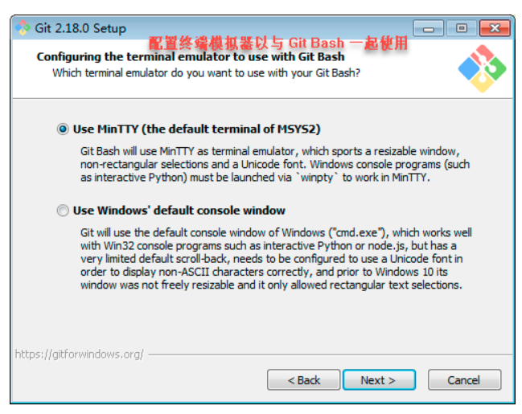
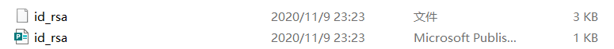

# git 
1、百度git官网，下载自己电脑版本的git安装包   
  
2、点击下载好的安装包，安装  

  

3、基本上一直点击Next  

   
   
   

1、Use Git from Git Bash only：这是最安全的选择，因为你的PATH根本不会被修改，你只能使用Git Bash的Git命令行工具。  

2、Use Git from the Windows Command Prompt：这个选项被认为是安全的，它只向PATH添加一些最小的Git包，以避免使用可选的Unix工具混淆环境。你将能够从Git Bash和Windows命令提示符中使用Git。建议选择此项。  

3、Use Git and optional Unix tools from the Windows Command Prompt：Git和可选的Unix工具都将添加到计算机的PATH中。警告：这将覆盖Windows工具，如“find”和“sort”，只有在了解其含义后才使用此选项。  
   
   
   
   
   

如上图所示，这表示 Git 已经安装完成了，至于图中的两个选择，则分别表示 打开 <b>Git Bash</b> 和 <b>浏览 Git 版本信息</b>，可以都选，也可以都不选，在这里，我们选择Launch Git Bash，进入如下界面：  
   
如上图所示，我们打开了 Git Bash，输入git命令，将显示如下结果：  
   

如上图所示，Git 已经准备就绪啦!!!

#### 安装后的设置：
1、git安装好后去GitHub上面注册一个账号，注册好后，点击Git Bash图标，打开git-bash使用账号进入环境配置了。  

   

1. \# 配置用户名  
git config --global user.name "username" //（ "username"是自己的账户名，）  
\# 配置邮箱  
 git config --global user.email "username@email.com"  // ("username@email.com"注
册账号时用的邮箱)   

2. 以上命令执行结束后，可用 git config --global --list 命令查看配置是否OK  
3. 生成ssh  
  继续刚才的操作，在命令框中输入以下命令：  
  ssh-keygen -t rsa  

然后连敲三次回车键，结束后去系统盘目录下（一般在 C:\Users\你的用户名.ssh）(mac: /Users/用户/.ssh）查看是否有。ssh文件夹生成，此文件夹中以下两个文件  

   

#### 将公钥添加到Github管理平台</b>  

将ssh文件夹中的公钥（ id_rsa.pub）添加到GitHub管理平台中，在GitHub的个人账户的设置中找到如下界面  
   

Title随意，将id_rsa.pub文件用文本编辑器打开，复制全部粘贴到key中，然后添加SSH公钥，添加成功如下所示  
   

#### 测试配置是否成功
在Git Bash中输入  
ssh -T git@github.com   

#### SSH警告
当你第一次使用Git的命令连接GitHub时，会得到一个警告：  

The authenticity of host 'github.com (xx.xx.xx.xx)' can't be established.  
RSA key fingerprint is xx.xx.xx.xx.xx.  
Are you sure you want to continue connecting (yes/no)?  

这是因为Git使用SSH连接，而SSH连接在第一次验证GitHub服务器的Key时，需要你确认GitHub的Key的指纹信息是否真的来自GitHub的服务器，输入yes回车即可。  
Git会输出一个警告，告诉你已经把GitHub的Key添加到本机的一个信任列表里了：  

Warning: Permanently added 'github.com' (RSA) to the list of known hosts.  

这个警告只会出现一次，后面的操作就不会有任何警告了。  
如果你实在担心有人冒充GitHub服务器，输入yes前可以对照GitHub的RSA Key的指纹信息是否与SSH连接给出的一致。  
出现以下结果表示配置成功  

   

完整结束！！！！

   
   
   