# Github
将本地项目上传到github的两种方法（当前仅试用过第一种）：  
二者使用前都必须操作的事情：  
1、得先开通自己的github账号，没有先去注册。  
2、下载安装git工具：即右键会有 Git GUI Here跟Git Bash Here这两个选项。  
3、进入github首页，点击 New repository新建一个项目，填写相应信息后点击create即可：  
创建仓库时会有以下选项：  
+ <b>Repository name</b>: 仓库名称
+ <b>Description(可选)</b>: 仓库描述介绍
+ <b>Public, Private </b>: 仓库权限（公开共享，私有或指定合作者，且私有收费）
+ <b>Initialize this repository with a README</b>: 添加一个EADME.md（注意，第二种方法创建的时候选择这个，在上传的时候会报一个错误，第二种方法下面会给解决方案）
+ <b>gitignore</b>: 不需要进行版本管理的仓库类型，对应生成 .gitignore文件（选填）
+ <b>license</b>: 证书类型，对应生成文件LICENSE（选填）  

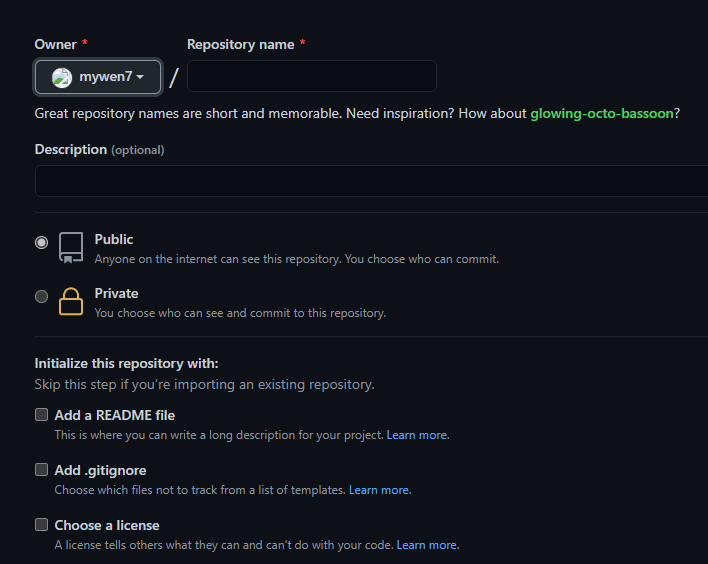  

创建完之后的样子（勾选了README.md） 
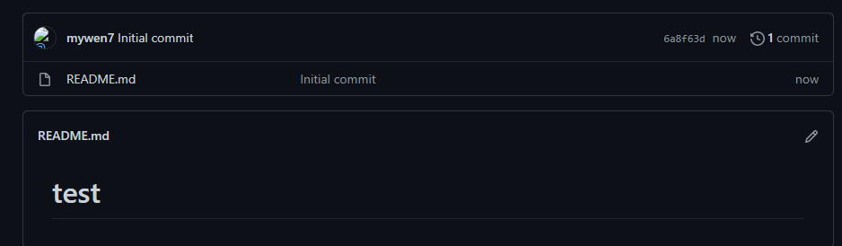  

## 第一种方法：
在项目主页面右边有这三个选项，点击Code会出现下面的地址。分别是HTTPS的，SSH的还有Github CLI的，右边有复制按钮，复制这个HTTPS的地址备用。  
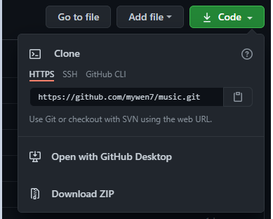   

接下来就是本地操作了：  
选中自己创建的项目右键，如果之前安装git成功的话，右键会有<b>Git Gui Here,Git Bash Here</b>，当前选择<b>Git Bash Here</b>打开，进入如下界面，然后是关键步骤：  

1. git clone https://github.com/mywen7/music.git      
此操作是把github上面的仓库克隆到本地
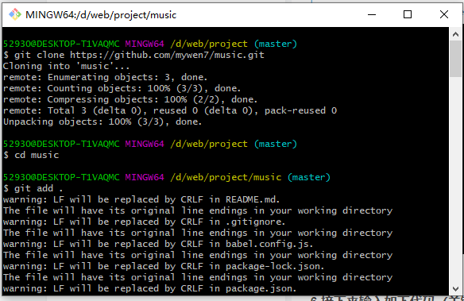   
2. 然后在本地项目文件夹下面会多出来一个github项目名的文件夹，（此时我会多出来一个music的文件夹），然后，将本地项目中的所有文件都移动到music文件夹中去  
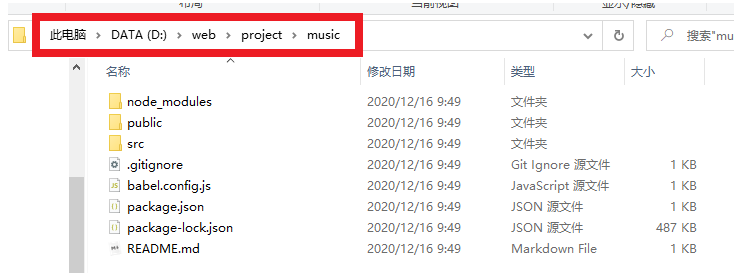   
上面这个本来在project文件夹中，现在全部移动到了music中，冲突的替换或者合并随自己操作，毕竟自己建的项目中可能就有README.md,github新建仓库时也可能创建一个README.md，所以随自己选择，这里project文件夹中有个隐藏的.git文件夹，music中也有个.git文件夹，我没有移动它（隐藏了，就当它不存在）  
3. 接着在Git Bash Here中输入命令：cd music，进入music文件夹  
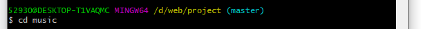   
4. 然后连续输入下面三个命令：  
    (1) git add .          (注：别忘记后面的 . ,此操作是吧music文件夹下面的文佳都添加进来)  
    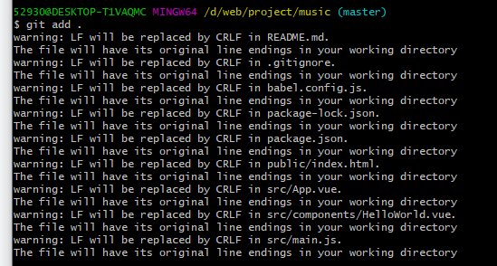   

    (2) git commit -m "提交信息"  （注：“提交信息”里面换成自己需要的备注信息）  
    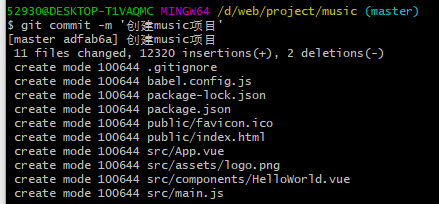   
    
    (3) git push -u origin master   (注：此操作目的是把本地仓库push到github上面，此步骤需要输入账号和密码（两次）)  
    &emsp;&emsp;此处还要注意的就是自己创建的项目在哪个分支上，然后自己github项目的分支又是哪个，要是分支不对，也会报错，要是分支不同，写的时候可以试试这样，毕竟我也没试过; git push -u origin master:develop，此处的master是本地的，develop是github远程的  
    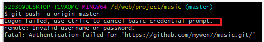   
    这里出错了：原因是两次的账号密码问题，  
    第一次：为github的登陆用户名和密码  
    第二次：为下面截图操作步骤最终填写的note（用户名） 和生成的tokens（密码）；  
    找到Settings -> Developer settings -> Personal access tokens -> Generate new token  
    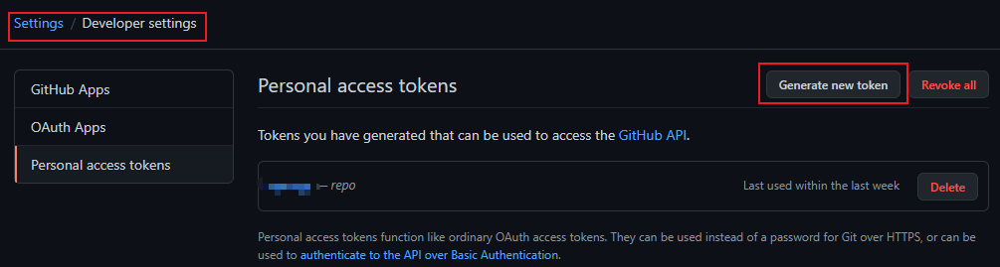   
    &emsp;&emsp;然后会出现这么个界面：用户名随自己想起啥就起啥，权限可以自己百度，第一个repo是选择要授权此令牌的作用域或权限。使用令牌从命令行访问仓库，勾选repo。其他的不晓得，没认真百度。  
    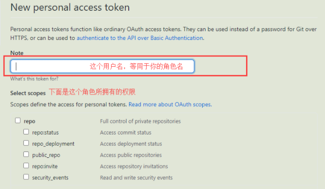   

&emsp;&emsp;写完Note跟勾选完权限，点击最后的Generate token，会生成一个token，  
&emsp;&emsp;单击复制按钮，复制token到剪贴板。关闭这个界面后，你就无法再次看到这个token了。  
&emsp;&emsp;然后第二次登陆用的用户名跟密码就是这个Note跟token了。

然后出现第二个错：  

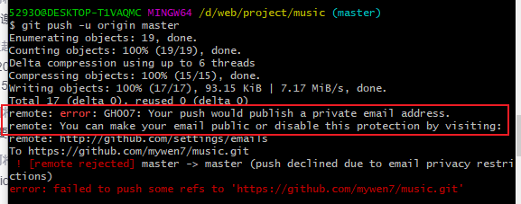   
原因是我把自己的email地址设置为私有的。  
在setting->emails->Keep my email address private，把这一项去掉勾选即可。  
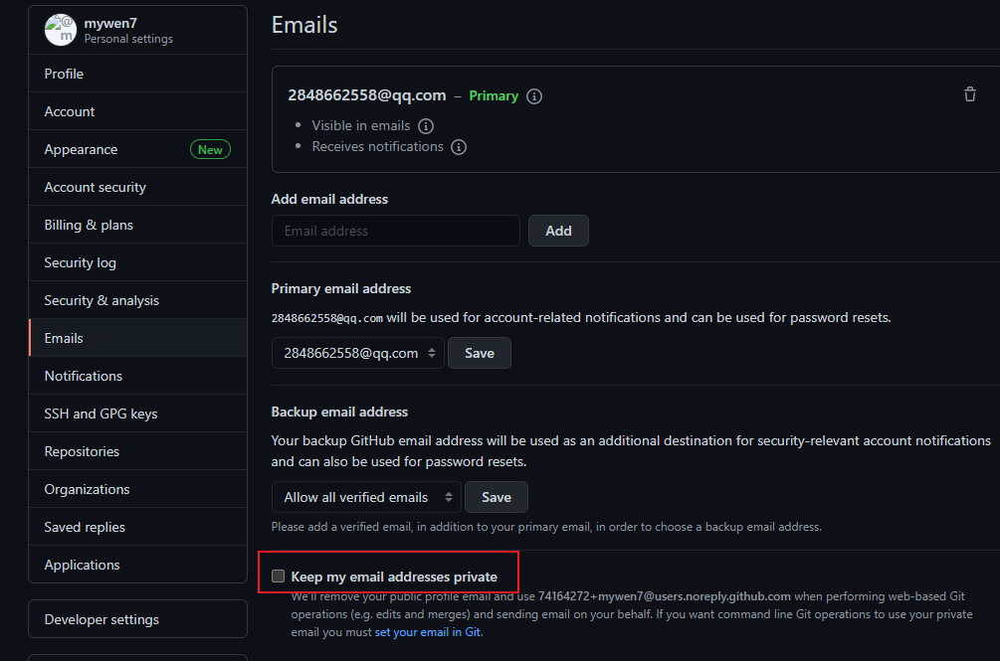    

最后成功完成（一把辛酸泪，唉）  
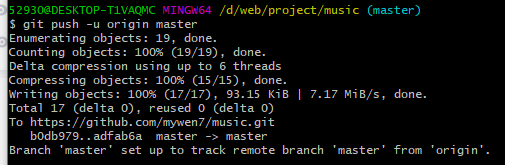    

## 第二种方法：
&emsp;&emsp;1、本地先创建一个空文件夹，可以直接新建也可以Git Bash Here窗口里的命令行新建（mkdir  TEST），然后进入这个文件夹（cd  TEST），桌面新建的就右键GIt Bash Here打开这个文件夹。  

&emsp;&emsp;2、git init 把这个文件夹变成Git可管理仓库：  
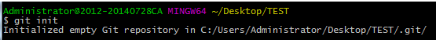    
这时候TEST文件夹里面会有个隐藏的.git文件夹，它是用来跟踪和管理版本库的，因为是隐藏的，可以设置文件夹选项让它可见。  

&emsp;&emsp;3、将自己的项目粘贴到TEST文件夹下  
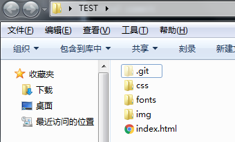    
&emsp;&emsp;4、 执行git add . 添加到仓库(此处add后面的 . 不可省略)。  
&emsp;&emsp;5、 执行git commit -m "XXX" 把项目提交到仓库  
&emsp;&emsp;6、由于本地Git仓库跟github仓库之间是SSH加密的，所以连接时需要配置：  
&emsp;&emsp;&emsp;&emsp;（1）、创建SSH KEY。先看一下C盘用户目录下有无.ssh文件夹，有的话看里面有无id_rsa和id_rsa.pub这两个文件，有就跳过。直接进行（2）没有的话进行以下操作：  
&emsp;&emsp;&emsp;&emsp;&emsp;&emsp;在Git Bash Here下执行以下命令：  
&emsp;&emsp;&emsp;&emsp;&emsp;&emsp;ssh-keygen -t rsa -C “youmeail@example.com"  
&emsp;&emsp;&emsp;&emsp;&emsp;&emsp;然后一路回车。这时你就会在.ssh目录里找到id_rsa和id_rsa.pub文件。  
&emsp;&emsp;&emsp;&emsp;（2）、登录github，找到Settings -> SSH and GPG KEYS ->New SSH key。
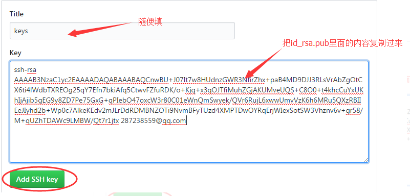    
Add SSH key之后就可以了。  
&emsp;&emsp;7、因为前面已经说过要建仓库的事了，这步不再多说（默认此刻已经有一个新建好的仓库）。我们开始将Github建好的仓库与本地仓库进行关联。复制主项目页面右边Code按钮展开后的HTTPS地址。  
&emsp;&emsp;8、在Git Bash Here上输入：  
&emsp;&emsp;git remote add origin https://github.com/guyibang/TEST2.git   
    
&emsp;&emsp;9、关联好之后我们就可以把本地库的所有内容推送到远程仓库上了。  
&emsp;&emsp;&emsp;&emsp;git push -u origin master   
&emsp;&emsp;由于新建的github仓库是空的，所以要加上-u这个参数，等远程仓库有了内容之后，下次本地上传内容就只需要git push origin master了这里也注意自己本地的分支跟仓库上的分支名称，可进行  
git push -u origin master：develop来试试  
&emsp;&emsp;10、此刻已完成上传  

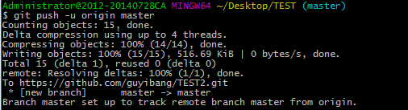    
第二个方法需要注意的是，在github上创建仓库时如果勾选了Initialize this repository with a README（就是创建仓库的时候自动给你创建一个README文件），那么到了第九步你将本地仓库内容推送到远程仓库的时候就会报一个failed to push some refs to https://github.com/guyibang/TEST2.git的错。   
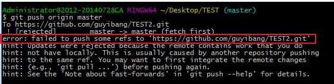    
&emsp;&emsp;这是由于你新创建的那个仓库里面的README文件不在本地仓库目录中，这时我们可以通过以下命令先将内容合并以下：  
&emsp;&emsp;$ git pull --rebase origin master  
之后再去push就可以成功了