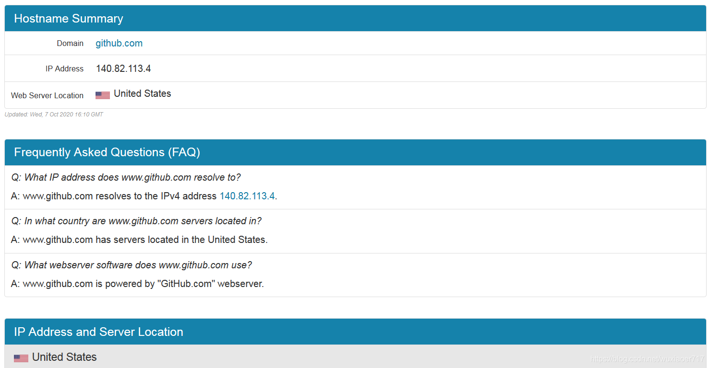
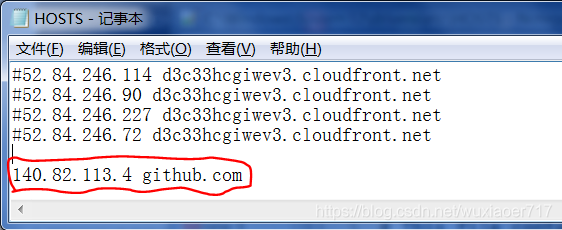
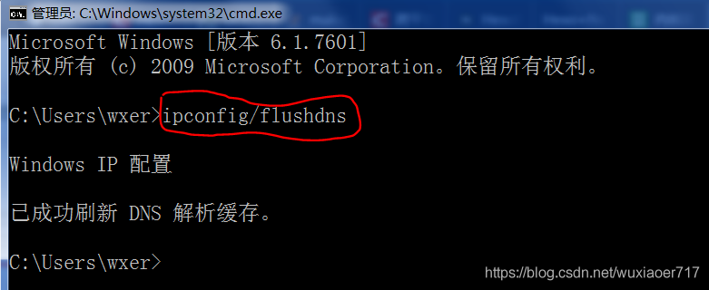

# GitHub访问失败解决
访问这个网址<https://github.com.ipaddress.com/www.github.com>  
查看当前github.com对应的IP地址。查到信息如下图  
  
修改hosts文件，windows系统下修改 C:\Windows\System32\drivers\etc\HOSTS文件，在该文件中添加github.com与IP的对应关系信息，如下图所示（可以先把它复制一份到桌面，修改完成之后再替换回去）  
  
修改完成后，在cmd中执行ipconfig/flushdns命令即可访问github网站了。  
  
