# nodejs -> npm -> vue

&emsp;&emsp;我们研究vue时，首先操作的就是vue的引用，大部分人为了方便直接在页面上引用vue.js，但是一些大型网站还是比较喜欢用vue的npm命令来安装vue并使用，之前研究vue时，研究过使用npm安装的方式，但是总是没装成功，当时因为一些原因就放弃了继续研究下去，直接引用vue.js的方式来学习vue。这两天刚好有时间来继续研究下vue的npm安装方式，中间也遇上了一些问题。折腾了两天总算搞完了，现在回想起来，也挺容易的。下面就从安装node.js到npm的设置，再到vue的安装的步骤来描述下过程。

## NodeJs

<b>第一步：</b>  
&emsp;&emsp;使用npm的命令来安装vue，首先电脑得安装node.js，才能使用，先从官网下载node.js，官网地址：<https://nodejs.org/en/>，除了更改安装路径，其他的直接默认“下一步”就可以。   

注意：  
&emsp;&emsp;node.js 最好安装到D盘，我本来是安装C盘，但是之前我电脑账户因为是公司的电脑，而当时我是非超级管理员的账户，node.js被我安装到了C盘，后面用npm的方式安装文件时，总是报错，提示没有权限。  
&emsp;&emsp;当然如果你的账号是电脑的管理员，node.js装到C盘，但是在启动cmd前要用“使用管理员方式打开”，否则npm命令安装时可能会出现没有权限的错误。  
&emsp;&emsp;个人是觉得装到D盘，可以避免一些错误，而且后期如果需要用npm安装一些插件啥的，或者是npm缓存，也可以节省C盘的磁盘空间。

 

<b>第二步：查看node.js和npm是否已安装成功</b>  
+ 1） “以管理员身份运行” cmd窗口，在窗口中输入命令： node -v  
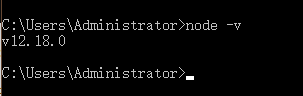  
如上图所示，输入命令后，出现nodeJS版本号，则说明nodeJS已安装成功  
+ 2）输入npm -v 命令，可查看nodejs是否已安装内置npm,  
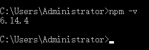  
如上图所示，如果有安装，则显示npm的版本号，一般情况下都自动安装npm,  
如果输入npm -v 报错，则表示没有安装内置的npm,则需要自己另外安装npm,这种情况比较少.这里就不做演示了  
+ 3） 输入命令：path  , 查看是否有nodejs的环境变量  
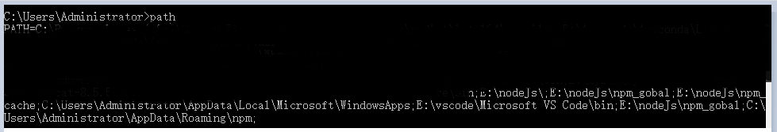  
&emsp;&emsp;如上图所示，如果有nondeJs的安装路径，则说明nodejs 已自动添加了path路径，如果没有，则需自己添加，添加方法：（以下是以win10为例）  
&emsp;&emsp;右击“此电脑”，“属性” -> "高级属性" -> “高级” 标签页 -> “环境变量” ：点击"path" -> 编辑->弹出框中点击空白行->浏览->选择nodejs安装的目录->确定->确定->确定->关闭属性窗口 ；  

环境变量已添加完。  

 

<b>第三步：配置npm</b>  
1）在nodejs安装目录新建两个文件夹 npm_gobal 和 npm_cache ：分别用于npm的全局路径和缓存路径。  
&emsp;&emsp;npm默认全局路径地址和缓存路径是在C盘的appData目录下，如果后期需要使用或者查看很不方便，而且还给C盘增加压力，因此最好修改下，一般情况下建议放到nodejs的安装目录下。  
2）设置npm全局路径和缓存路径的环境变量：  
&emsp;&emsp;右击“此电脑”，“属性” -> "高级属性" -> “高级” 标签页 -> “环境变量” ：点击"path" -> 编辑->点击弹出框中点击空白行->浏览->选择新建的npm_gobal文件夹->确定  
&emsp;&emsp;->点击弹出框中点击空白行->浏览->选择新建的npm_cache文件夹->确定->确定->关闭属性窗口 
3）“以管理员身份” 运行cmd, 用命令配置npm:  
配置npm的全局路径： npm config set prefix "D:\Program Files\nodejs\npm_global"   
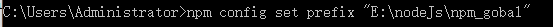    
配置npm的缓存路径：npm  config set cache "D:\Program Files\nodejs\npm_cache"  
    
更换镜像站为国内的淘宝镜像站：npm config set registry="http://registry.npm.taobao.org"   
    
由此，npm已配置好，可通过命令： npm config ls  查看npm的所有配置  

 

<b>第四步:</b>   
&emsp;&emsp;命令安装vue，在cmd窗口中输入并执行命令： npm install -g @vue/cli  
&emsp;&emsp;注意以上命令是安装全局的vue, 安装后可执行命令： vue --version 查看是否安装成功，如果安装成功可看到vue的版本号  
此刻一直显示：'vue' 不是内部或外部命令,也不是可运行的程序 或批处理文件。  
百度得到的都是执行npm config list命令，拿到prefix对应的路径，打开查看里面有没有vue.cmd文件，有的话，将此路径添加到环境变量Path中，

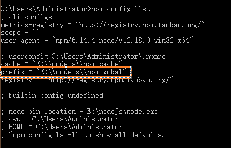    

在环境变量中又配置了一番无果，未解决。  
最后找到一篇文章：  
直接在系统变量中新建  
  

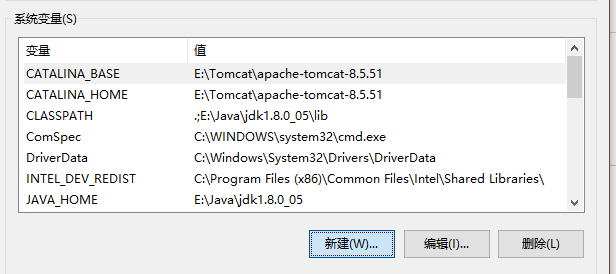    

此处变量值为自己vue所在路径  
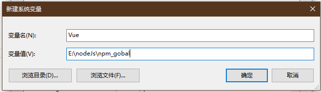    

重启cmd，运行vue --version 成功！！！显示vue版本号  
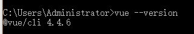    

如果prefix对应的路径里面没有vue.cmd文件，则到环境变量中执行下列操作：  

+ 一、在系统变量中新建NPM，变量值为prefix对应的路径信息，一般是：            
&emsp;&emsp;C:\Users\xxx\AppData\Roaming\npm  
&emsp;&emsp;再在系统变量中找到path，添加%NPM%，然后保存。

+ 二、安装cnpm  
&emsp;&emsp;npm install -g cnpm （安装cnpm）
+ 三、最关键  
&emsp;&emsp;npm i npm -g npm i @vue/cli -g   // 如果还报错也没关系，继续执行下面的命令  
&emsp;&emsp;cnpm i @vue/cli -g   

出现All packages installed (used 6ms(network 2ms), speed 0B/s, json 0(0B), tarball 0B)就是成功啦！可以用vue -V试试，能正常出现版本信息就是完美成功！  
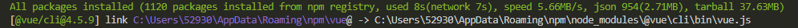    

注意：如果到第四步执行报rollbackFailedOptional verb npm-session 的错误，则需要设置npm的代理服务器，以下需要根据各自的网络需求来定：  
&emsp;&emsp;在cmd窗口执行下面两个命令：  
&emsp;&emsp;&emsp;&emsp;命令1：npm config proxy 代理服务地址和端口  
&emsp;&emsp;&emsp;&emsp;命令2：npm config set https-proxy 代理服务器地址和端口  
&emsp;&emsp;有些还需要设置git代理服务器，有些不需要，如果有需要则执行以下两个命令：  
&emsp;&emsp;&emsp;&emsp;命令1：git config --global http.proxy 代理服务地址和端口  
&emsp;&emsp;&emsp;&emsp;命令2：git config --global http.proxy 代理服务地址和端口  

如果所用网络不需要代理，则要把npm代理和git代理去掉  
&emsp;&emsp;删除npm 代理：  
&emsp;&emsp;&emsp;&emsp;命令1：npm config delete proxy  
&emsp;&emsp;&emsp;&emsp;命令2：npm config delete https-proxy  
&emsp;&emsp;删除git代理：  
&emsp;&emsp;&emsp;&emsp;命令1：git config --global --unset http.proxy  
&emsp;&emsp;&emsp;&emsp;命令2：git config --global --unset https:proxy  

设置完成后，重新操作上面第四步，就可以了。

## Vue 
<b>第一步:  全局安装vue/cli脚手架</b>  
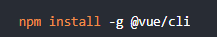  
<b>第二步：检查版本： vue --version 或者（vue -V）</b>  
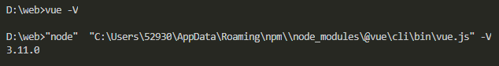  
<b>第三步：在一个文件夹（相当vs工作空间的文件夹）内新建项目文件 </b>   
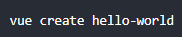  
<b>第四步：选择新建项目都需要包含什么</b>  
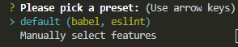   

default选项为默认选择，仅包含（babel，eslint）；  
Manually select features 为手动选择  
注：使用↑↓选择键进行选择，回车确认  
下一步进入手动选择页面：  
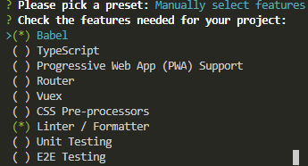   
注：使用空格键进行单个选中与取消    
因为手动选择需要的包，所以会出现下面各个单选的情况，再次按需进行选择  
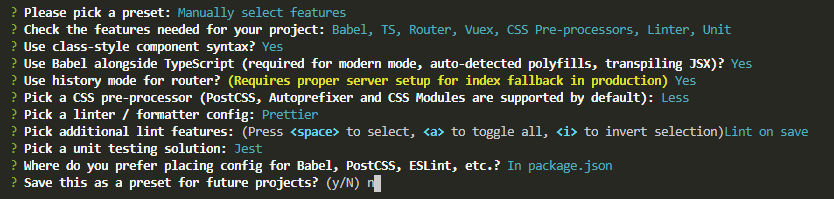   
